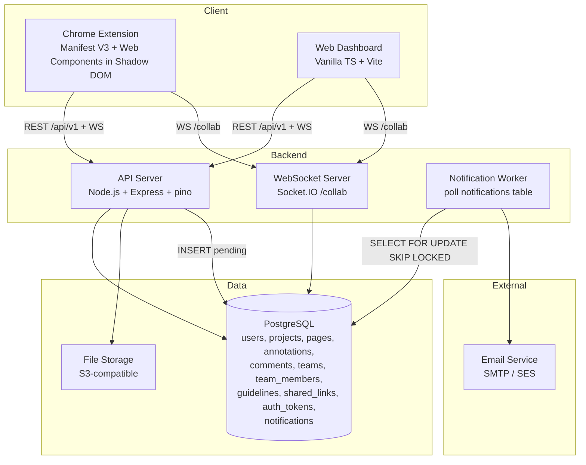
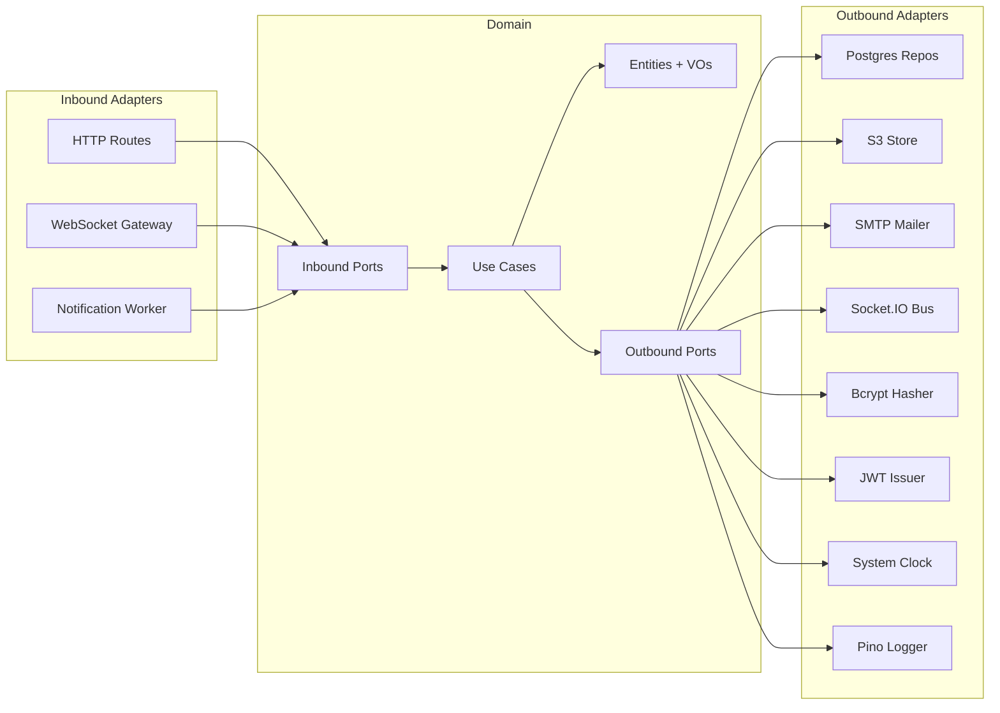
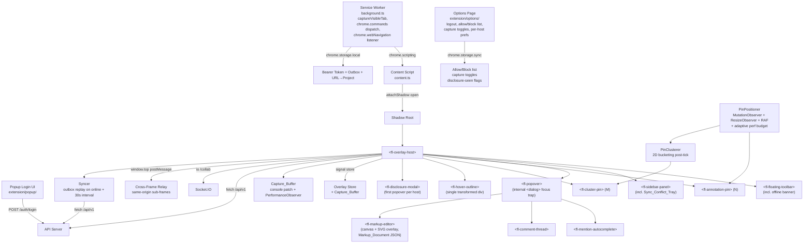
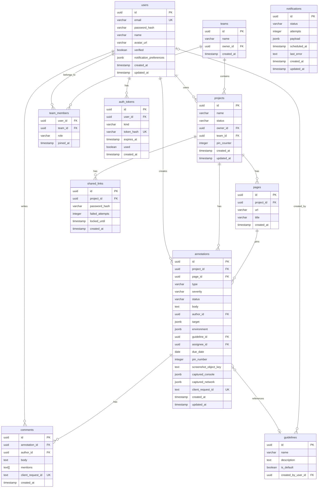

# Design Document: Pinpoint App

## Overview

Pinpoint is a collaborative website feedback platform composed of two client surfaces — a Chrome Extension (Manifest V3) and a Web Dashboard — backed by a Node.js + Express API server with PostgreSQL persistence and Socket.IO real-time collaboration. Users annotate live websites by clicking DOM elements, leaving Notes, Suggestions, or Guideline observations with a severity, and collaborating with team members in real time.

This revision of the design replaces the React runtime in both clients with native browser primitives (Web Components in the Extension, vanilla TypeScript with HTML `<template>` elements and CSS Modules in the Dashboard) and locks in decisions for: User-Agent driven environment capture, cookie+CSRF Dashboard sessions paired with bearer tokens for the Extension, a first-class `pages` table, race-free pin numbering through a per-project counter row, a durable `notifications` queue with exponential backoff, structured logging, a versioned `/api/v1` URL space, and a one-command `docker compose up` development stack with GitHub Actions CI.

This revision additionally lays in the Extension capabilities driven by Requirements 32–53: a CRXJS-Vite installable bundle with bundled icons and narrowed permissions; an in-extension popup login surface and an options page hosting logout, allow/block lists, and capture toggles; sliding-window JWT refresh; service-worker-driven viewport screenshots stored in S3 with server-side PII blur; a canvas-plus-SVG markup editor persisting a `Markup_Document` JSON; a rolling `Capture_Buffer` of console messages and Resource Timing entries attached to bug reports; an element-hover preview implemented as a single transformed outline div; SPA navigation handling via patched History API plus `chrome.webNavigation.onHistoryStateUpdated`; a manual project picker with a `chrome.storage.local` URL→Project cache; `chrome.commands` keyboard shortcuts; per-URL draft persistence in `chrome.storage.session`; native `<dialog>`-based focus trap with full ARIA semantics; `prefers-color-scheme` dark mode that swaps only neutrals; an offline mode built on an outbox-pattern queue with `client_request_id` server idempotency, ID-rewriting on success, and a Sync_Conflict_Tray for rejected replays; client-side bounding-box PII redaction with canonical server-side blur; a per-site allow/block list synced via `chrome.storage.sync`; a first-popover-per-host "What gets sent" disclosure modal; cross-frame click relay from same-origin sub-frames to a single top-frame overlay host; CSP-strict resilience via Shadow DOM + constructable stylesheets with a `<style>` fallback; per-Custom-Element error boundaries; an adaptive MutationObserver perf budget that downgrades to a 250 ms throttle under sustained mutation load; a `PinClusterer` that merges overlapping pins into virtual cluster pins; and a `extension/store/` Web Store listing bundle with semver-tracked changelog. A V2 appendix documents Session Replay and its integration constraints.

### Key Design Decisions

These are the decisions that drive the rest of the document. Each is a "we picked X over Y because Z" — not a list of options.

1. **TypeScript everywhere, Zod at the boundary.** Shared types (`shared/`) compile-check the same model in three packages; Zod schemas validate over the wire. Cheap insurance against "the field name was different on the other side" bugs.

2. **No React. Vanilla TypeScript + native primitives.** (Req 31)
   - **Dashboard** — Vanilla TS, HTML `<template>` elements cloned into the DOM, scoped styles via **CSS Modules** (Vite supports them out of the box), and a tiny home-grown reactive primitive — `signal<T>()`, ~30 LOC — that drives DOM updates. Routing is the History API behind a 50-line router. The dashboard already builds with Vite, so we keep Vite and only swap out `@vitejs/plugin-react`.
   - **Extension** — Web Components (Custom Elements + Shadow DOM). One element per UI piece: `<fl-floating-toolbar>`, `<fl-popover>`, `<fl-sidebar-panel>`, `<fl-annotation-pin>`, `<fl-mention-autocomplete>`, `<fl-comment-thread>`, plus an `<fl-overlay-host>` root. Shared styles are an `adoptedStyleSheets` constructable stylesheet exported from `shared/` so the palette never drifts between elements.
   - **State** — one in-memory store per surface, exposing `signal()` slices. No Redux, no MobX.
   - Rationale: spec ACs are surgical (no animation libraries, no motion-DOM tricks, modest interactivity). The cost of React (bundle size, hydration, re-render reasoning) is not paid back here. Web Components are a perfect fit for an extension that lives inside a Shadow DOM root anyway. Vanilla TS in the Dashboard keeps the build dependency graph small and the runtime obvious.
   - Migration order: extract pure logic (already TS), then port leaf components (`<fl-annotation-pin>`, `<fl-floating-toolbar>`, `<fl-mention-autocomplete>`), then containers (`<fl-popover>`, `<fl-sidebar-panel>`, `<fl-comment-thread>`), then the host. Both implementations may coexist behind a `VITE_FL_USE_LEGACY_REACT` flag during cutover.

3. **Browser/OS detection: `bowser`.** (Req 17)
   `bowser` is ~5KB minified, MIT, and exposes a parser that produces a normalized `{ browser, os, platform }` shape. The competing `ua-parser-js` is larger and historically had a known supply-chain incident (2021); avoiding it is worth the few extra LOC of normalization. We wrap `bowser` in `shared/src/userAgent.ts → parseUserAgent(uaString: string): EnvironmentMetadata` which:
   - Maps `bowser`'s browser name to the closed enum (`Chrome | Edge | Safari | Firefox | Opera | Brave | Arc | Other | unknown`).
   - For **Brave** detection: UA strings claim "Chrome", so we check `navigator.brave?.isBrave?.()` at call sites and override `browserFamily` in the resulting `EnvironmentMetadata` before sending it. Pure UA-only would miss Brave entirely.
   - For **Arc** detection: Arc also presents as "Chrome". Heuristic: `getComputedStyle(document.documentElement).getPropertyValue('--arc-palette-background')` is non-empty inside Arc. Fall back to "Chrome" when unsure rather than guessing.
   - The function never throws — for any input string it returns a valid `EnvironmentMetadata` with `browserFamily='unknown'` and `browserVersion=null` if parsing fails. This is **Property 11**.

4. **Auth: cookie+CSRF for Dashboard, bearer JWT for Extension.** (Reqs 18, 19, 20, 21)
   - The Dashboard runs on a known origin and can use cookies. The Extension is cross-origin to every host page it injects into and **cannot** use site cookies. So the API server issues both: a `Set-Cookie: fl_session=<jwt>; HttpOnly; Secure; SameSite=Lax; Path=/` cookie for the Dashboard, AND a JSON `{ token }` field in the response body for the Extension to read and stash in `chrome.storage.local`.
   - **CSRF** — double-submit cookie. On login the server also sets `fl_csrf=<random32>; SameSite=Lax; Path=/` (no `HttpOnly`, so JS can read it) and includes the same value in the login response body for first-load convenience. Dashboard echoes it as `X-CSRF-Token` on every state-changing request. Middleware checks `header == cookie` for `POST/PUT/PATCH/DELETE`. The Extension's bearer-token requests are exempt because they're already proof-of-possession.
   - **Email verification** — the existing `password_resets` table is repurposed as `auth_tokens` with a `kind` column (`'verify_email' | 'reset_password' | 'team_invite'`). One concept instead of three single-use-token tables; the schema is the same shape (hash, expires_at, used).
   - **Rate limiting** — `express-rate-limit` with a separate **stricter** limiter (10 req / 15 min, Req 19.1) wired only to `/auth/login`, `/auth/register`, `/auth/reset-password`, and `/shared/:linkId/verify`. Keyed on `req.ip + (email || '')` so an attacker rotating IPs against one account is still throttled by the email half of the key.
   - **Production secret guard** — a `validateConfig()` function called *before* `httpServer.listen` throws if `NODE_ENV=production` AND `JWT_SECRET` is unset/empty/`dev-secret`/`dev-secret-change-in-production`/`change-me`. Process exits with code 1.

5. **Real-time wiring: URL→Project→Members→Socket.** (Reqs 6, 22)
   - New `GET /api/v1/projects/by-url?url=<encoded>` and `GET /api/v1/projects/:id/members` REST endpoints.
   - Extension flow on overlay enable: (a) read bearer from `chrome.storage.local`, (b) `GET /projects/by-url` with `window.location.href`, (c) on 404 show "No project for this URL" toast and skip socket connect, (d) on 200 `GET /projects/:id/members` and store in the overlay store, (e) `io('/collab', { auth: { token, projectId } })`.
   - **Co-viewer presence** (Req 6.6, 6.7) — each annotation gets a Socket.IO room keyed `annotation:${id}`. Server holds an in-memory `Map<annotationId, Set<userId>>`. On `annotation:open` the server adds the user, broadcasts `annotation:viewers` to that annotation's room with the current user list. On `annotation:close` (or disconnect) it removes them and re-broadcasts. Persistence is in-memory only; on reconnect the client re-emits `annotation:open` for whichever annotation it has open.

6. **DOM targeting resilience: a single `PinPositioner`.** (Req 14)
   One class manages all pins on a page. It owns:
   - a `MutationObserver(document.body, { subtree: true, childList: true, attributes: true, attributeFilter: ['class','style','hidden'] })`,
   - a `ResizeObserver(document.documentElement)`,
   - a passive `scroll` listener on `document` and a `resize` listener on `window`, both throttled with `requestAnimationFrame` so multiple events in one frame coalesce into one tick.
   On each tick it runs `getBoundingClientRect()` for every pin's resolved element and writes `transform: translate3d(x, y, 0)` to the pin element via `style.setProperty`. Resolved-element-null pins use the stored `pageX/pageY` and gain `data-fallback="true"`, which the stylesheet renders with a warning ring.

7. **Page entity & migration.** (Req 23)
   New `pages` table with `(id, project_id, url, title, created_at)` and a unique `(project_id, url)`. Annotations gain `page_id NOT NULL` referencing `pages.id`. The migration:
   ```sql
   -- 1) backfill
   INSERT INTO pages (id, project_id, url, title, created_at)
   SELECT gen_random_uuid(), a.project_id, a.page_url, NULL, MIN(a.created_at)
   FROM annotations a
   GROUP BY a.project_id, a.page_url
   ON CONFLICT (project_id, url) DO NOTHING;

   -- 2) wire annotations
   UPDATE annotations a SET page_id = p.id
   FROM pages p
   WHERE p.project_id = a.project_id AND p.url = a.page_url;

   -- 3) lock down
   ALTER TABLE annotations ALTER COLUMN page_id SET NOT NULL;
   ALTER TABLE annotations DROP COLUMN page_url;
   ```
   Down-migration adds `page_url` back, copies it from `pages.url` via the foreign key, then drops `page_id`.
   Page deletion: `DELETE /api/v1/projects/:id/pages/:pageId?onNonEmpty=cascade|block` (default `block`). Cascade deletes the page and its annotations in one transaction; block returns 409 with `{ count }`.

8. **Race-free pin numbering: row counter on `projects`.** (Req 24)
   ```sql
   ALTER TABLE projects ADD COLUMN pin_counter integer NOT NULL DEFAULT 0;
   ```
   Annotation insert is wrapped in a transaction:
   ```sql
   BEGIN;
   UPDATE projects SET pin_counter = pin_counter + 1 WHERE id = $1 RETURNING pin_counter;
   INSERT INTO annotations (..., pin_number) VALUES (..., $pin_counter);
   COMMIT;
   ```
   Why not a per-project Postgres `SEQUENCE`? Dynamically named sequences (`seq_project_<uuid>`) are awkward to manage — one DDL per project, custom cleanup on project delete, and they can't be referenced declaratively from a column default. The row-counter pattern is one less concept and inherits MVCC: the row-level lock taken by `UPDATE … RETURNING` serializes concurrent inserts in that project. This is **Property 12**.

9. **Shared link lockout: one service function.** (Req 15)
   All callers go through `verifyLinkPassword(linkId, password)` in `server/src/services/sharedLinks.ts`. State machine:
   ```
   load link
   if locked_until is set AND locked_until > now()  → return 423 with Retry-After
   if locked_until is set AND locked_until <= now() → reset failed_attempts=0, locked_until=NULL
   bcrypt.compare(password, password_hash):
     match    → reset failed_attempts=0, locked_until=NULL → return 200
     mismatch → failed_attempts += 1
                if failed_attempts >= 3 → locked_until = now() + 15 min → return 423
                else                    → return 401
   ```
   This is the *only* place those columns mutate. **Property 13** validates the state machine.

10. **API versioning.** (Req 25)
    All routers mount under `/api/v1`. A catch-all `/api/*` (matched after `/api/v1` so it only fires for non-v1 paths) returns:
    ```json
    {
      "error": {
        "code": "API_VERSION_REMOVED",
        "message": "This endpoint moved to /api/v1.",
        "newPath": "/api/v1/<remainder>"
      }
    }
    ```
    with HTTP 410. The Dashboard `lib/api.ts` and Extension `lib/api.ts` both use a single `API_BASE = '/api/v1'` constant.

11. **Shared palette & labels: `shared/src/theme.ts`.** (Req 26)
    Single source of truth for both colors and labels:
    ```ts
    export const SEVERITY_COLORS = {
      critical:      '#ef4444',
      major:         '#f97316',
      minor:         '#eab308',
      informational: '#3b82f6',
    } as const;
    export const STATUS_LABELS = {
      active:      'Open',
      in_progress: 'In Progress',
      resolved:    'Resolved',
    } as const;
    ```
    Also exported as a CSS Custom Properties block (`--fl-severity-critical: #ef4444;` etc.) emitted by a small `themeCss()` helper. Both clients adopt it at root scope: the Dashboard via a `<style>` tag injected at boot, the Extension via the constructable stylesheet attached to every Shadow Root. Existing duplicates collapse: `extension/src/components/SidebarPanel.tsx` (literal CSS), `extension/src/content.ts` (overlay CSS), and the inline `SEVERITY_COLORS` map in `dashboard/src/pages/ProjectView.tsx` all import from `@pinpoint/shared/theme`.

12. **Structured logging: `pino` + `pino-http`.** (Req 27)
    `pino-http` middleware injects a `req.id = uuid v4()` (or the inbound `X-Request-Id` if present) and attaches a child logger to every request. One JSON record per request (method, path, status, latency_ms, request_id, user_id when authenticated). Errors log `error.code/message/stack` with the same `request_id`. All `console.error/log/warn` in `server/src/index.ts` and route handlers are replaced with `req.log.*` (or the root logger for boot-time messages).

13. **Durable notification queue: a polled Postgres table.** (Req 28)
    New `notifications` table. The worker is a single async loop with `setInterval(poll, 5_000)`:
    ```ts
    async function poll() {
      await db.transaction(async (tx) => {
        const rows = await tx.raw(`
          SELECT id, payload, attempts FROM notifications
          WHERE status='pending' AND scheduled_at <= now()
          ORDER BY scheduled_at
          LIMIT 10
          FOR UPDATE SKIP LOCKED
        `);
        for (const r of rows) await dispatch(tx, r);
      });
    }
    ```
    `FOR UPDATE SKIP LOCKED` lets multiple worker instances run concurrently without double-sending. Backoff schedule: `2^attempts` minutes, capped at 32 (so 2, 4, 8, 16, 32). On startup we don't need any explicit replay logic — rows still in `status='pending'` with `scheduled_at < now()` are simply picked up by the next poll. Worth stating explicitly because a junior reader will look for replay code.
    Why not Redis/RabbitMQ/SQS? We already have Postgres, and the volume here is "one row per @mention". Adding a broker would be premature optimization.

14. **Docker Compose & CI.** (Reqs 29, 30)
    `docker-compose.yml` services:
    - `db` — `postgres:16-alpine` with `healthcheck: pg_isready`.
    - `migrate` — one-shot, `depends_on: { db: { condition: service_healthy } }`, command `knex migrate:latest`.
    - `api` — `depends_on: { migrate: { condition: service_completed_successfully } }`.
    - `dashboard` — runs the production `vite preview` on the built bundle.
    GitHub Actions workflow: `on: pull_request` to default branch, matrix on Node 20, jobs `lint`, `typecheck`, `unit`, `property`. The `unit` and `property` jobs use a Postgres service container so the integration suites have a real DB.

15. **Bundler: `@crxjs/vite-plugin`.** (Req 32.1)
    The current `tsc --build` does not produce a Web Store-loadable `dist/` and cannot watch content scripts. We replace it with `@crxjs/vite-plugin`, which is purpose-built for Manifest V3, hot-reloads content scripts during development, and outputs a `dist/` that Chrome's "Load unpacked" accepts as-is. We keep Vite as the underlying bundler so the Dashboard and Extension share toolchain and the dependency graph stays small. The competing `@samrum/vite-plugin-web-extension` is a viable alternative, but CRXJS has wider adoption and cleaner MV3 ergonomics. Picked CRXJS.

16. **Icons: bundled placeholder PNGs at `extension/icons/`.** (Req 32.2)
    Stock 16/48/128 placeholder PNGs live at `extension/icons/icon16.png`, `extension/icons/icon48.png`, and `extension/icons/icon128.png`, referenced by `manifest.json.icons` and `manifest.json.action.default_icon`. Production icons land before V1 release; the path stays the same so the swap is a file replacement.

17. **Permissions: narrow + dynamic host_permissions.** (Reqs 32.3, 46)
    `manifest.json` declares only `activeTab`, `scripting`, `storage`, and `tabs` (the last is required for `chrome.tabs.captureVisibleTab` from the service worker). The broad `"matches": ["<all_urls>"]` is removed; instead `host_permissions` is derived from the user-configured allow-list at install time. For arbitrary hosts on demand, we use `chrome.scripting.executeScript({ target: { tabId } })` from the service worker after `chrome.permissions.request()`. This is the smallest blast radius compatible with the spec and aligns with Chrome Web Store permission-warning best practices.

18. **Auth UI: popup login + options page logout.** (Reqs 33.1, 33.2, 46, 47, 51.3)
    The popup is the lightest surface for "sign in" — a one-screen email/password form that POSTs to `/api/v1/auth/login` and stores the returned bearer in `chrome.storage.local`. The options page (`extension/options/`) hosts everything stateful: logout (calls `POST /api/v1/auth/logout`, clears `chrome.storage.local`), the allow-list and block-list textareas, the global capture toggles (screenshot, console, network), per-host overrides (perf budget opt-out, capture toggles), and a link to the privacy policy. Splitting these surfaces keeps the popup a single-purpose authentication entry point and the options page the durable-settings home — a UX pattern users already know from every well-designed extension.

19. **Token refresh: sliding-window JWT.** (Reqs 33.3, 33.4, 33.5)
    Bearer tokens have a 1-hour lifetime. The Extension's API client wraps every fetch:
    - **Before** the call, if `exp - now < 5 minutes`, the client first hits `POST /api/v1/auth/refresh` with the current token, swaps in the new token, then proceeds with the original request.
    - **After** a `401` response on any call, the client clears the token from `chrome.storage.local` and opens the popup login surface (`chrome.action.setPopup` + `chrome.action.openPopup` where available, otherwise a notification asking the user to click the Extension icon).
    The server's `/auth/refresh` accepts tokens within a 7-day grace window past `exp` so a paused-tab user is not silently kicked out. This sliding-window pattern is operationally simple (one short-lived JWT, no refresh-token table) and matches the spec's "valid or recently-expired-within-grace-window" criterion exactly. We picked this over a separate refresh-token table because the volume does not justify a second token type.

20. **Screenshots: service-worker-driven, separate POST upload.** (Req 34)
    Only the service worker can call `chrome.tabs.captureVisibleTab`. The flow:
    1. Content script `postMessage`s the popover submit to background with a request id.
    2. Background calls `chrome.tabs.captureVisibleTab(tabId, { format: 'png' })` and returns the base64 PNG to the content script over `chrome.runtime.sendMessage`.
    3. Content script POSTs the annotation as JSON to `POST /api/v1/projects/:id/annotations` (so the create stays small and snappy).
    4. On 201, content script POSTs the screenshot to a separate `POST /api/v1/annotations/:id/screenshot` as `multipart/form-data` carrying the PNG plus a `redaction_rects` JSON payload (Req 45).
    5. Server stores the PNG via the existing S3-compatible client, applies server-side Gaussian blur over `redaction_rects`, persists the resulting object key in `annotations.screenshot_object_key`, and broadcasts an `annotation:updated` so viewers see the screenshot appear.
    Per-annotation toggle in the popover defaults to "on"; users can disable it on a per-annotation basis (Req 34.2). We picked the separate-upload pattern over a `multipart/form-data` create because (a) the create path stays JSON and trivially testable, (b) screenshot capture and upload do not block annotation creation, (c) clients can retry the screenshot upload independently if it fails.
    **Schema:** `annotations.screenshot_object_key TEXT NULL`.

21. **Markup: canvas overlay + `Markup_Document` JSON.** (Req 35)
    The markup editor renders the screenshot in a `<canvas>` and overlays a transparent SVG editor for shape primitives (rectangle, arrow, freehand stroke, pixelate). The persisted `Markup_Document` is small JSON of the form `{ shapes: [ { type: 'arrow', x1, y1, x2, y2, color }, … ] }` (full schema below). On view we composite the SVG over the screenshot. **Undo** is a stack of operations — each shape add or pixelate region is one entry; undo pops the top of the stack. We picked vector-only persistence (not raster) so we can re-render at any zoom and so the canonical screenshot stays untouched (the redaction step in Req 45 is the only mutation the server applies to the bitmap).

22. **Console & network capture: patched `console` + `PerformanceObserver`.** (Req 36)
    The content script (in its own isolated world) wraps `console.log`, `console.warn`, and `console.error` and pushes formatted records into a 50-item ring buffer (`Capture_Buffer.console`). A `new PerformanceObserver({ type: 'resource', buffered: true })` keeps the most recent 50 Resource Timing entries (`Capture_Buffer.network`). Both buffers live on the overlay store. On bug-report submit (type=note, severity ∈ {Critical, Major}) the content script attaches both arrays to the create-Annotation request body. The options page exposes a global "Disable console and network capture" toggle. We picked patching `console` over a `Reporting API` integration because the Reporting API is not consistently surfaced in extension contexts, and we picked `PerformanceObserver` over polling `performance.getEntriesByType` because the observer never misses a resource between polls.
    **Schema:** `annotations.captured_console JSONB NULL` and `annotations.captured_network JSONB NULL`.

23. **Hover preview: single absolutely-positioned outline div.** (Req 37)
    A single `<div>` lives in the Shadow DOM with `pointer-events: none; position: fixed; box-shadow: 0 0 0 2px var(--fl-accent); transition: transform 80ms ease-out;`. On `pointermove` we compute `document.elementFromPoint(e.clientX, e.clientY)`, run its `getBoundingClientRect()`, and update `transform`, `width`, and `height` on the same outline div. The work is throttled with `requestAnimationFrame` so we never repaint more than once per frame. One element instead of N keeps GC pressure flat and keeps the DOM small even on complex pages. The outline disappears the moment the user clicks (`pointerdown` removes its `data-active` attribute).

24. **SPA navigation: patched History API + `chrome.webNavigation.onHistoryStateUpdated`.** (Req 38)
    Two signals, belt-and-braces. The content script monkey-patches `history.pushState` and `history.replaceState` to dispatch a `pinpoint:locationchange` `CustomEvent` after the original call returns. The service worker listens to `chrome.webNavigation.onHistoryStateUpdated` and forwards a message to the active tab's content script. On either signal the Extension re-resolves the project via `GET /api/v1/projects/by-url`, refreshes the sidebar and pin list, and joins the new project's collaboration room. We picked dual signaling because monkey-patching alone misses programmatic frame nav and `webNavigation` alone misses some `replaceState` calls; together they catch every case.

25. **Project picker fallback: recent-first dropdown + URL→Project cache.** (Req 39)
    `chrome.storage.local.fl_url_to_project` holds a `Map<urlPattern, { projectId, lastSelectedAt }>`. A normalization rule (`origin + pathname`, query and hash dropped) drives lookups so a user who manually picked a project for `https://app.example.com/dashboard?t=1` will auto-select it on `https://app.example.com/dashboard?t=2`. The dropdown lists the user's accessible projects ordered by `lastSelectedAt` descending. We picked client-side normalization over a server-side "best match" query because the server has no business storing per-user URL→Project preferences and the cache has zero ambiguity in practice.

26. **Keyboard shortcuts: `chrome.commands`.** (Req 40)
    `manifest.json.commands` declares the four bindings exactly as in the spec (Req 40.1) — `toggle-overlay`, `toggle-sidebar`, `next-pin`, `prev-pin`. The service worker subscribes to `chrome.commands.onCommand` and dispatches each command to the active tab via `chrome.tabs.sendMessage(tabId, { type: 'command', name })`; the content script's overlay store handles each. Users can remap each command at `chrome://extensions/shortcuts`.

27. **Draft persistence: `chrome.storage.session` keyed by URL.** (Req 41)
    On every popover `input` event we debounce 300 ms and write `{ [url]: { type, severity, body, target, updatedAt } }`. On popover open we look up the current URL and prefill. On submit success we delete the entry. We picked `chrome.storage.session` over `chrome.storage.local` so drafts evaporate when the browser closes — they exist to survive an accidental dismissal or one tab reload, not to persist indefinitely. URL is the natural key because the same DOM target on a different page is a different annotation.

28. **Accessibility: native `<dialog>` + `popover` API.** (Req 42)
    `<fl-popover>` extends `HTMLElement` but its internal Shadow DOM template wraps the content in a native `<dialog>`. Calling `dialog.showModal()` gives us focus trap, `Escape` semantics, and focus restore for free — three things hand-rolled implementations always get subtly wrong. ARIA roles are added per element: `role="toolbar"` on `<fl-floating-toolbar>`, `role="listbox"` and `aria-activedescendant` on `<fl-mention-autocomplete>`, `role="listbox"` on the sidebar list. Arrow-key navigation is implemented in the affected elements' `connectedCallback`. We picked native `<dialog>` over a hand-rolled focus trap (e.g., `focus-trap` lib) because it is one less dependency and the platform is simply better at this than userland.

29. **Dark mode: CSS Custom Properties under `prefers-color-scheme`.** (Req 43)
    `themeCss()` already emits `--fl-*` variables. We add a `@media (prefers-color-scheme: dark)` block that overrides only neutrals — `--fl-bg`, `--fl-surface`, `--fl-text`, `--fl-border`, `--fl-muted`. Severity values stay constant per Req 43.2 because severity carries a semantic meaning (Critical is red) that should not flip in the dark. The constructable stylesheet attached to every Custom Element's Shadow Root carries both blocks; a single OS preference change ripples through every element automatically.

30. **Offline mode: outbox + Syncer + server idempotency.** (Req 44)
    The Extension's API client always writes mutations (create/update/status-change annotations and create-comments) to a `chrome.storage.local.fl_outbox` array first, returns a local UUID immediately, and inserts an optimistic local row. A `Syncer` runs on the `online` event and on a 30-second `setInterval`, replaying entries in original order via the existing `/api/v1` endpoints with a `clientRequestId` field carrying the local UUID.
    - **Server idempotency.** New columns `annotations.client_request_id TEXT NULL` and `comments.client_request_id TEXT NULL`, each with a partial UNIQUE index `WHERE client_request_id IS NOT NULL`. Create endpoints accept an optional `clientRequestId`; on duplicate the server returns the existing row with HTTP 200 and an `X-FL-Idempotent-Replay: true` header (rather than 409 — see Error Handling).
    - **ID rewriting on success.** When the server returns the canonical `id` (and `pinNumber` for annotations), the Syncer updates the local row in the overlay store and rewrites every reference in the outbox (e.g., a queued comment that referred to the still-local annotation by local UUID is patched to the canonical id before its own POST).
    - **Conflict handling.** On 403/404/409 (other than the idempotent-replay 200 above), the entry moves to a `Sync_Conflict_Tray` rendered in the sidebar with the conflict reason and Retry / Edit / Discard actions.
    - **Bounded operations.** Resolving an annotation that has not yet synced (its local row has no server-assigned `id`) is disabled in the UI until ID rewriting completes (Req 44.5).
    - **Offline detection.** The overlay shows an "Offline" banner when `navigator.onLine === false` OR when an actively-failing-API heartbeat (one `GET /api/v1/health` every 30 s) has failed twice in a row.
    - **Selector re-resolution on replay.** When replaying a queued create-Annotation, the Syncer re-runs `DOMTargetResolver.resolveSelector` against the live page; mismatches mark the local pin with `data-fallback="true"` (Req 44.6).
    We picked the outbox pattern over an in-memory queue because `chrome.storage.local` survives service-worker terminations and tab closes — the spec demands durability across page reload (Req 44.2). We picked `client_request_id`-based idempotency over an `If-Match` ETag scheme because the server does not need to know prior content to dedupe a creation; the client-supplied UUID is sufficient.

31. **PII redaction: client-side bounding boxes + canonical server-side blur.** (Req 45)
    Two-step. (a) **Client-side.** Before submitting the screenshot, the content script computes a list of `BoundingBox` rects for elements that match the redaction predicate: `<input type="password">`, `<input>` with `autocomplete` matching `/^cc-/`, any element with `data-fl-redact`, any element with `aria-label` matching the configured PII regex, minus any element with `data-fl-no-redact`. The rects are computed in document coordinates relative to the screenshot's top-left, then shipped with the upload as a `redaction_rects` JSON field. The markup editor also exposes a manual paint-over tool that produces additional rects via the pixelate primitive. (b) **Server-side.** The screenshot upload handler decodes the PNG, applies a Gaussian blur over each rect using `sharp`, re-encodes, and only then writes the bitmap to S3. **The pre-blur in the editor is purely visual; canonical redaction is server-side so a malicious client cannot un-redact** (a client-only blur could be reverted by a tampered Extension fork posting an unblurred PNG). This decision is documented because the difference matters.

32. **Allow/block list: options page + `chrome.storage.sync`.** (Req 46)
    The options page (`extension/options/`) renders a textarea per list (one host pattern per line). Storage is `chrome.storage.sync` so the lists follow the user across machines. The content script's bootstrap reads both lists synchronously from `chrome.storage.sync` (or its in-memory cache) and bails out before any DOM observation if the current host matches the block-list, or if the allow-list is non-empty and the current host does not match. Patterns accept exact hosts (`example.com`) and wildcard prefixes (`*.bank.example.com`). Match is performed against `location.hostname`.

33. **"What gets sent" disclosure: first-popover-on-host modal.** (Req 47)
    On the first popover open per host (and after any capture-toggles change), `<fl-popover>` shows a Shadow-DOM modal listing every category of data that will be sent: annotation body, screenshot, console buffer, network buffer, environment metadata, page URL, target selector. The modal exposes a "View privacy policy" link to a manifest constant URL (`MANIFEST.privacyPolicyUrl = 'https://pinpoint.example/privacy'`) and a button "Open settings" that opens the options page via `chrome.runtime.openOptionsPage()`. The "seen" flag is `chrome.storage.sync.fl_disclosure_seen[host]`, a record keyed by host. Flipping any capture toggle in the options page bumps a `disclosureGeneration` counter that resets all hosts. We picked sync storage so a user who has dismissed the disclosure on machine A is not re-prompted on machine B.

34. **Cross-frame: top-frame ownership + iframe relay.** (Req 48)
    The top frame owns the single `<fl-overlay-host>`. Same-origin sub-frames inject only a tiny click-relay stub: on user click in the sub-frame, the stub computes the target's `getBoundingClientRect()` translated into the top frame's document coordinates (using the iframe's offset), bundles the css/xpath selector for the in-frame element, and `postMessage`s the bundle to `window.top` with `targetOrigin: location.origin`. The top frame validates the message origin against `window.location.origin`, resolves the target into a `DOMTarget`, and opens the popover anchored at the relayed coordinates. Cross-origin frames are skipped per Req 48.3 (the manifest does not list `<all_urls>` in `host_permissions`, so cross-origin injection cannot happen accidentally).

35. **CSP-strict resilience: Shadow DOM + constructable stylesheets, with `<style>` fallback.** (Req 49)
    No inline event handlers anywhere — every listener is added via `addEventListener` in `connectedCallback`. No `eval`, `Function()`, or string-to-template tricks. Styles live in a single constructable `CSSStyleSheet` adopted via `Element.prototype.adoptedStyleSheets`; if `adoptedStyleSheets` is unavailable (older browsers in the field), each Shadow Root falls back to a static `<style>` element cloned from a shared template. Verified by an integration test that injects a CSP `default-src 'none'; script-src 'self'` page and confirms the overlay still renders.

36. **Error boundaries: per-Custom-Element try/catch + content-script outer boundary.** (Req 50)
    Every Custom Element's `connectedCallback`, `disconnectedCallback`, and externally-callable methods are wrapped by a `withBoundary(name, fn)` helper that catches both sync throws and rejected promises. On error the helper logs via the structured-logger pattern (`{ component, request_id?, error.code, error.message, error.stack }`) and renders a localized inline `<fl-error-tag>` Custom Element ("Something went wrong") inside the affected component while leaving siblings untouched. A higher-level `ContentScriptBoundary` wraps mount/unmount in `try/catch` so an exception during overlay mount can never propagate into the host page's runtime.

37. **MutationObserver perf budget: adaptive throttling.** (Req 51)
    PinPositioner counts mutation events in a 5-second sliding window of 1-second buckets. Default schedule is `requestAnimationFrame` (one tick per frame). When the count exceeds 60/s sustained for 5 seconds the positioner switches to a 250 ms `setTimeout`-based throttle and logs a structured warning (`{ component: 'PinPositioner', event: 'perf-downgrade', mutationsPerSecond }`). When the rate drops below 30/s for 5 seconds we switch back. The options page exposes a per-host opt-out toggle that disables layout-driven repositioning entirely; pins remain at their stored coordinates. We picked the sliding-window counter over a single-sample rate because the spec explicitly demands the "60 events/s sustained over 5 seconds" criterion.

38. **Pin clustering: `PinClusterer` runs after every PinPositioner tick.** (Req 52)
    After every `PinPositioner.tick()`, a `PinClusterer.recompute()` pass divides the viewport into 2D buckets of side `R` (default `R = 24` px). Pins are assigned to the bucket containing their current screen coordinate. Buckets with two or more pins are emitted as a virtual `<fl-cluster-pin>` Custom Element labeled with the count; buckets with one pin emit the individual `<fl-annotation-pin>`. Click on a cluster opens a list popover showing the contained annotations. The clusterer re-runs on zoom and layout changes (driven by the same observers PinPositioner already owns). We picked simple bucket assignment over k-means or DBSCAN because (a) the spec describes overlap, not semantic clustering, (b) bucketing is O(N), (c) it is deterministic — useful for the property test (Property 16).

39. **Web Store listing: `extension/store/` directory.** (Req 53)
    All assets and copy required to publish ship in the repo. Directory layout below in the "Web Store Listing Bundle" subsection. Versioning is semver in `manifest.json.version` (must be the canonical x.y.z form Chrome accepts) and tracked in `extension/CHANGELOG.md`.

40. **Session Replay (V2 only).** (V2-1)
    Deferred from V1 because of bundle size (`rrweb` ~30 KB minified plus a per-second event payload), the privacy work needed to redact replay events end-to-end, and the storage cost of replay payloads. When taken up, it integrates with **PII redaction (Req 45)** — every input event with a redactable target is dropped before recording, and the redaction predicate is identical to the screenshot path so users have one mental model. It also integrates with the **disclosure modal (Req 47)** — replay capture is added as an additional category in the disclosure list, and an options page toggle flips it on or off. We recommend `rrweb` over `playback.js` for breadth and active maintenance. See "V2: Session Replay" below.

41. **API Server is hexagonal (ports & adapters).** (Req 54)

    Decision: organize the API server as a Domain layer (entities, use cases, ports), an Adapters layer split into Inbound (`adapters/inbound/{http,websocket,workers}`) and Outbound (`adapters/outbound/{postgres,s3,smtp,socket,bcrypt,jwt,clock,logger}`), and a Composition Root that wires adapters into use cases at boot.

    Why hexagonal over Clean Architecture's four-ring formulation: the difference is small at the level of TypeScript code; both put domain logic in the middle and dependencies pointing inward. We pick hexagonal because (a) the system has multiple inbound triggers for the same domain operations — REST routes, WebSocket events, the notification queue worker, the offline outbox replayer — and hexagonal models these uniformly as inbound adapters; (b) the team is small and the four-ring ceremony pays back less than the simpler "ports & adapters" mental model; (c) property-based tests get clean substitution via in-memory `FakeRepo`/`FakeMailer`/`FakeBlobStore`/`FakeClock` adapters with no extra ring boundaries to think about.

    Why not "service layer + repositories" (a flat 3-layer pattern): it tends to leak ORM types into the application services and makes it hard to substitute infrastructure in tests. Hexagonal forces dependency direction inward through ports.

    Lint enforcement: `eslint-plugin-import` `no-restricted-paths` (or `dependency-cruiser`) in CI prevents `server/src/domain/**` from importing `server/src/adapters/**` or any infrastructure package.

42. **Unit / property test runner: Vitest.** (covers Reqs 13, 17, 24, 27, 30, 44, 52, 54)

    Decision: Vitest is the single test runner for unit, integration, and property-based tests across `shared/`, `server/`, `dashboard/`, and `extension/`. Playwright is the only test framework above Vitest, and it is used exclusively for end-to-end browser flows.

    Why Vitest over Jest: Vitest is already pinned at the workspace root (`vitest@^3.2.1`) and every existing test file in the repo imports from it; switching would burn time without buying anything. Vitest's native ESM and TypeScript support eliminates the `ts-jest` / `babel-jest` configuration burden, and its Vite alignment means the dashboard and extension test setups reuse the same module-resolution behaviour they already use at build time (CSS Modules, `@pinpoint/shared` workspace import, the upcoming `@crxjs/vite-plugin`). Watch mode is fast enough to leave running.

    Why Vitest over Mocha+Chai+Sinon: a hand-assembled stack costs maintenance for no gain at our test volume.

    What plugs into Vitest:
    - **fast-check** (already in `devDependencies`) — every numbered correctness property (1–16) runs as a Vitest test invoking `fc.assert(fc.property(…))` with at least 100 iterations.
    - **jsdom** (already in `devDependencies`) — DOM environment for the extension and dashboard tests; configured per-package via `test.environment: 'jsdom'` so server tests stay in Node.
    - **`vi.mock` is reserved for module-level seams** (e.g., the SMTP transport, the S3 client, `chrome.tabs.captureVisibleTab`). Domain Use_Case tests do **not** use `vi.mock` — they use the in-memory `Fake*` adapters described in the Hexagonal Layered Structure section, injected through constructors. This keeps domain tests framework-agnostic.
    - **Vitest workspaces** — a root `vitest.workspace.ts` enumerates the four packages so a single `npm test` at the repo root runs everything; each package's `vitest.config.ts` sets its own `environment` (jsdom for clients, node for server) and its own coverage thresholds.
    - **`@vitest/coverage-v8`** — coverage with native V8 instrumentation; the CI workflow fails when domain-layer coverage drops below 80% line + 70% branch.

### High-Level Architecture Diagram



#### API Server — Hexagonal Layout



## Architecture

### System Components

The system is organized into four deployable units:

1. **Chrome Extension** (`pinpoint/extension/`) — Manifest V3 with a service worker, a content script that mounts the `<fl-overlay-host>` Custom Element inside a Shadow DOM root, and an options page.
2. **Web Dashboard** (`pinpoint/dashboard/`) — Vanilla TS SPA built by Vite, served as static assets, communicating with the API server via `/api/v1`.
3. **API Server** (`pinpoint/server/`) — Express application exposing REST under `/api/v1` and a Socket.IO WebSocket server on the same HTTP listener.
4. **Shared Library** (`pinpoint/shared/`) — TypeScript types, Zod schemas, serialization utilities, the `parseUserAgent` module, and the `SEVERITY_COLORS` / `STATUS_LABELS` / `themeCss()` exports.

### Extension Architecture (Manifest V3)



`<fl-overlay-host>` is the only element the content script appends to the Shadow Root. It owns the overlay store (signals for `annotations`, `comments`, `selectedAnnotationId`, `popoverTarget`, `members`, `reconnecting`, `viewersByAnnotation`) and instantiates `PinPositioner`. Child elements observe slices of the store and re-render their own subtree. The shared constructable stylesheet is attached to every element's Shadow Root via `adoptedStyleSheets`.

### Background Service Worker Responsibilities

`extension/src/background.ts` is the only place that holds privileged Chrome APIs. Its responsibilities, listed alongside the Requirement that drives each, are:

- **Token storage broker.** Reads/writes `chrome.storage.local.fl_token` on behalf of the popup, options page, and content scripts. (Reqs 33.1, 33.2, 33.5)
- **`captureVisibleTab` orchestration.** Receives a `{ type: 'capture', requestId }` message from the content script, calls `chrome.tabs.captureVisibleTab(tab.windowId, { format: 'png' })`, and replies with the base64 PNG. The content script never calls `captureVisibleTab` directly because only the service worker has the privilege. (Req 34.1)
- **`chrome.commands` dispatch.** Subscribes to `chrome.commands.onCommand`; dispatches each command (`toggle-overlay`, `toggle-sidebar`, `next-pin`, `prev-pin`) via `chrome.tabs.sendMessage(activeTabId, { type: 'command', name })`. (Req 40.1, 40.2)
- **`chrome.webNavigation.onHistoryStateUpdated` listener.** Forwards the URL change as a `{ type: 'spa-nav', url }` message to the active tab's content script so SPA frame navigation triggers a project re-resolution even when `history.pushState` was called via a path the in-page monkey patch missed. (Req 38.1)
- **`chrome.scripting.executeScript`.** When the user grants ad-hoc host permission via `chrome.permissions.request`, the service worker injects the content script bundle on demand instead of relying on the manifest's static `content_scripts` declaration. (Req 32.3)
- **Options-page open broker.** Exposes `chrome.runtime.openOptionsPage()` to the disclosure modal's "Open settings" button so the modal can route the user to the options page. (Req 47.2)
- **Periodic Syncer trigger.** Sets `chrome.alarms.create('fl-syncer', { periodInMinutes: 0.5 })` and forwards each `onAlarm` to the active tab's content script, so the outbox replay heartbeat fires even when the tab is backgrounded. (Req 44.3)

### Authentication Flow

```mermaid
sequenceDiagram
    participant DB as Dashboard (browser)
    participant EX as Extension (chrome.storage)
    participant API as API Server

    Note over DB,API: Dashboard — cookie + CSRF
    DB->>API: POST /api/v1/auth/login {email, password}
    API->>API: bcrypt.compare; sign JWT; rand(32) CSRF
    API-->>DB: 200<br/>Set-Cookie: fl_session=jwt; HttpOnly; Secure; SameSite=Lax<br/>Set-Cookie: fl_csrf=token; SameSite=Lax<br/>Body: { user, csrfToken }
    DB->>API: POST /api/v1/projects (Cookie + X-CSRF-Token)
    API->>API: header == cookie?
    API-->>DB: 201

    Note over EX,API: Extension — bearer JWT
    EX->>API: POST /api/v1/auth/login {email, password}
    API-->>EX: 200<br/>Body: { user, token }
    EX->>EX: chrome.storage.local.set({ token })
    EX->>API: POST /api/v1/projects (Authorization: Bearer)
    API-->>EX: 201
```

### API Server Architecture

```mermaid
graph TB
    subgraph Express App
        MW[Middleware<br/>pino-http, cors, json, csrf, auth, rate-limit]
        AUTHRL[Stricter rate limit<br/>auth/* + shared/verify]
        R1[/api/v1/auth/*]
        R2[/api/v1/projects/*]
        R3[/api/v1/annotations/*]
        R4[/api/v1/teams/*]
        R5[/api/v1/users/*]
        R6[/api/v1/guidelines/*]
        R7[/api/v1/shared/*]
        LEGACY[catch-all /api/*<br/>→ 410 API_VERSION_REMOVED]
    end

    subgraph Socket.IO
        NS[Namespace: /collab]
        RM_PROJ[Room per Project]
        RM_ANN[Room per Annotation]
    end

    MW --> AUTHRL --> R1
    MW --> R2 & R3 & R4 & R5 & R6 & R7
    MW --> LEGACY
    R3 -->|emit| NS
    NS --> RM_PROJ
    NS --> RM_ANN
```

### API Server Layered Structure (Hexagonal)

The API server follows a hexagonal (ports & adapters) architecture. Domain code is pure TypeScript with no Express, no PostgreSQL driver, and no Socket.IO imports; all infrastructure is reached through outbound port interfaces, and all external triggers (HTTP, WebSocket, queue worker) enter through inbound adapters.

The directory layout:
```
server/src/
├── domain/                              # pure TS — no Express, PG, Socket.IO
│   ├── annotation/
│   │   ├── Annotation.ts                # entity
│   │   ├── DOMTarget.ts                 # value object
│   │   ├── EnvironmentMetadata.ts       # value object
│   │   ├── AnnotationErrors.ts          # domain errors
│   │   ├── usecases/
│   │   │   ├── createAnnotation.ts
│   │   │   ├── updateAnnotation.ts
│   │   │   ├── changeAnnotationStatus.ts
│   │   │   ├── deleteAnnotation.ts
│   │   │   └── attachScreenshot.ts
│   │   └── ports/
│   │       ├── AnnotationRepo.ts        # outbound
│   │       ├── ScreenshotStore.ts       # outbound
│   │       ├── ProjectPinSequence.ts    # outbound
│   │       └── EventBus.ts              # outbound
│   ├── auth/
│   │   ├── User.ts
│   │   ├── AuthToken.ts
│   │   ├── AuthErrors.ts
│   │   ├── usecases/
│   │   │   ├── registerUser.ts
│   │   │   ├── login.ts
│   │   │   ├── refreshToken.ts
│   │   │   ├── verifyEmail.ts
│   │   │   ├── requestPasswordReset.ts
│   │   │   └── completePasswordReset.ts
│   │   └── ports/
│   │       ├── UserRepo.ts
│   │       ├── AuthTokenRepo.ts
│   │       ├── PasswordHasher.ts
│   │       ├── TokenIssuer.ts
│   │       ├── Mailer.ts
│   │       └── Clock.ts
│   ├── project/
│   │   ├── Project.ts
│   │   ├── Page.ts
│   │   ├── usecases/
│   │   │   ├── createProject.ts
│   │   │   ├── searchProjects.ts
│   │   │   ├── archiveProject.ts
│   │   │   ├── deleteProject.ts
│   │   │   ├── deletePage.ts
│   │   │   ├── resolveProjectByUrl.ts
│   │   │   └── listProjectMembers.ts
│   │   └── ports/
│   │       ├── ProjectRepo.ts
│   │       └── PageRepo.ts
│   ├── comment/
│   │   ├── Comment.ts
│   │   ├── usecases/
│   │   │   ├── createComment.ts
│   │   │   └── listComments.ts
│   │   └── ports/CommentRepo.ts
│   ├── team/
│   │   ├── Team.ts
│   │   ├── TeamMember.ts
│   │   ├── usecases/
│   │   │   ├── createTeam.ts
│   │   │   ├── inviteMember.ts
│   │   │   ├── updateMemberRole.ts
│   │   │   └── removeMember.ts
│   │   └── ports/
│   │       ├── TeamRepo.ts
│   │       └── TeamMemberRepo.ts
│   ├── analytics/
│   │   ├── usecases/computeAnalytics.ts
│   │   └── ports/AnalyticsRepo.ts
│   ├── notification/
│   │   ├── Notification.ts
│   │   ├── usecases/
│   │   │   ├── enqueueNotification.ts
│   │   │   └── dispatchPendingNotifications.ts
│   │   └── ports/
│   │       ├── NotificationQueue.ts
│   │       └── Mailer.ts
│   ├── sharedLink/
│   │   ├── SharedLink.ts
│   │   ├── usecases/
│   │   │   ├── createSharedLink.ts
│   │   │   └── verifyLinkPassword.ts
│   │   └── ports/SharedLinkRepo.ts
│   ├── guideline/
│   │   ├── Guideline.ts
│   │   ├── usecases/{listGuidelines, createCustomGuideline}.ts
│   │   └── ports/GuidelineRepo.ts
│   ├── export/
│   │   ├── usecases/exportProjectReport.ts
│   │   └── ports/{ReportRenderer, ObjectStore}.ts
│   └── shared/
│       ├── Result.ts
│       ├── Id.ts
│       └── DomainError.ts
├── adapters/
│   ├── inbound/
│   │   ├── http/                        # Express routes — thin
│   │   │   ├── auth.routes.ts
│   │   │   ├── projects.routes.ts
│   │   │   ├── annotations.routes.ts
│   │   │   ├── comments.routes.ts
│   │   │   ├── teams.routes.ts
│   │   │   ├── users.routes.ts
│   │   │   ├── guidelines.routes.ts
│   │   │   └── shared.routes.ts
│   │   ├── websocket/                   # Socket.IO handlers — thin
│   │   │   └── collab.gateway.ts
│   │   └── workers/                     # background loops
│   │       ├── notificationWorker.ts
│   │       └── outboxReplayWorker.ts    # (V1: extension-side; placeholder here)
│   └── outbound/
│       ├── postgres/
│       │   ├── PgUserRepo.ts
│       │   ├── PgProjectRepo.ts
│       │   ├── PgPageRepo.ts
│       │   ├── PgAnnotationRepo.ts
│       │   ├── PgCommentRepo.ts
│       │   ├── PgTeamRepo.ts
│       │   ├── PgTeamMemberRepo.ts
│       │   ├── PgSharedLinkRepo.ts
│       │   ├── PgGuidelineRepo.ts
│       │   ├── PgAuthTokenRepo.ts
│       │   ├── PgNotificationQueue.ts
│       │   ├── PgProjectPinSequence.ts
│       │   └── PgAnalyticsRepo.ts
│       ├── s3/
│       │   └── S3ScreenshotStore.ts
│       ├── smtp/
│       │   └── NodemailerMailer.ts
│       ├── socket/
│       │   └── SocketIoEventBus.ts
│       ├── bcrypt/
│       │   └── BcryptPasswordHasher.ts
│       ├── jwt/
│       │   └── JwtTokenIssuer.ts
│       ├── clock/
│       │   └── SystemClock.ts
│       └── logger/
│           └── PinoLogger.ts
└── composition/
    └── container.ts                     # composition root
```

Outbound port catalog (key shapes — short illustrative TypeScript, not exhaustive):

```ts
// domain/annotation/ports/AnnotationRepo.ts
export interface AnnotationRepo {
  insert(input: NewAnnotation): Promise<Annotation>;          // uses ProjectPinSequence in the same tx
  findById(id: string): Promise<Annotation | null>;
  listByProject(projectId: string, filter?: { status?: AnnotationStatus }): Promise<Annotation[]>;
  update(id: string, patch: AnnotationPatch): Promise<Annotation>;
  delete(id: string): Promise<void>;
  setScreenshotKey(id: string, key: string): Promise<void>;
  findByClientRequestId(clientRequestId: string): Promise<Annotation | null>;  // for offline idempotency
}

// domain/annotation/ports/ProjectPinSequence.ts
export interface ProjectPinSequence {
  next(projectId: string, tx: TxHandle): Promise<number>;     // atomic increment used in same tx as insert
}

// domain/annotation/ports/EventBus.ts
export interface EventBus {
  emit(event: DomainEvent): void;                             // socket adapter implements; tests use FakeEventBus
}

// domain/auth/ports/PasswordHasher.ts
export interface PasswordHasher {
  hash(plain: string): Promise<string>;
  verify(plain: string, hash: string): Promise<boolean>;
}

// domain/auth/ports/TokenIssuer.ts
export interface TokenIssuer {
  sign(payload: TokenPayload, ttlSeconds: number): string;
  verify(token: string): TokenPayload;
  graceWindowSeconds: number;                                  // for refresh past exp
}

// domain/notification/ports/NotificationQueue.ts
export interface NotificationQueue {
  enqueue(payload: NotificationPayload, scheduledAt: Date): Promise<void>;
  claimDue(limit: number): Promise<Notification[]>;            // SELECT FOR UPDATE SKIP LOCKED
  markSent(id: string): Promise<void>;
  markPending(id: string, attempts: number, scheduledAt: Date, lastError: string): Promise<void>;
  markFailed(id: string, lastError: string): Promise<void>;
}
```

Inbound adapter shape (each route handler is ~10 lines):

```ts
// adapters/inbound/http/annotations.routes.ts
export function annotationsRouter(usecases: Container) {
  const r = Router();
  r.post('/projects/:id/annotations', async (req, res, next) => {
    try {
      const input = CreateAnnotationSchema.parse({ ...req.body, projectId: req.params.id, authorId: req.user.id });
      const out = await usecases.createAnnotation.exec(input);
      res.status(201).json(out);
    } catch (e) { next(e); }
  });
  // … other routes
  return r;
}
```

Composition root (boot wiring):

```ts
// composition/container.ts
export function buildContainer(cfg: Config) {
  const db = new Knex(cfg.db);
  const clock: Clock = new SystemClock();
  const logger = new PinoLogger();

  // outbound adapters
  const userRepo = new PgUserRepo(db);
  const annotationRepo = new PgAnnotationRepo(db);
  const projectRepo = new PgProjectRepo(db);
  const pinSequence = new PgProjectPinSequence(db);
  const queue = new PgNotificationQueue(db);
  const mailer = new NodemailerMailer(cfg.smtp);
  const screenshots = new S3ScreenshotStore(cfg.s3);
  const events = new SocketIoEventBus(cfg.io);
  const hasher = new BcryptPasswordHasher();
  const tokens = new JwtTokenIssuer(cfg.jwt);

  // use cases — pure domain wired to outbound ports
  return {
    createAnnotation: new CreateAnnotation({ annotationRepo, pinSequence, events, clock }),
    login:           new Login({ userRepo, hasher, tokens, clock }),
    refreshToken:    new RefreshToken({ tokens, clock }),
    verifyEmail:     new VerifyEmail({ userRepo, authTokenRepo: new PgAuthTokenRepo(db), clock }),
    enqueueNotification: new EnqueueNotification({ queue, clock }),
    dispatchNotifications: new DispatchPendingNotifications({ queue, mailer, clock, logger }),
    // … etc
  } as const;
}
```

### Architecture Enforcement (lint)

The hexagonal boundary is enforced statically in CI. We use `eslint-plugin-import`'s `no-restricted-paths` rule (or, equivalently, a `dependency-cruiser` config) to forbid imports from `server/src/domain/**` to `server/src/adapters/**` and to any infrastructure package (`pg`, `knex`, `express`, `socket.io`, `bcrypt`, `jsonwebtoken`, `nodemailer`, `pino`, `aws-sdk`, `@aws-sdk/*`). Domain modules may only import from `server/src/domain/**` and from standard-library / utility-only modules in `server/src/shared/**` (which itself contains no infrastructure imports).

Sample `eslint-plugin-import` configuration:
```js
// .eslintrc.cjs (server)
module.exports = {
  plugins: ['import'],
  rules: {
    'import/no-restricted-paths': ['error', {
      zones: [
        {
          target: './server/src/domain',
          from: './server/src/adapters',
          message: 'Domain code must not import adapters. Depend on a port interface instead.',
        },
        {
          target: './server/src/domain',
          from: './node_modules',
          except: ['zod'],
          message: 'Domain code must not import infrastructure packages.',
        },
      ],
    }],
  },
};
```

The CI workflow runs `npm run lint` as a required check on every pull request; a violation fails the job and blocks the PR. The same boundary is independently verified by a `dependency-cruiser` rule (`forbidden: [{ from: { path: '^server/src/domain' }, to: { path: '^server/src/adapters' } }]`) so that adopting either tool catches the same regressions.

### Real-Time Collaboration Flow

```mermaid
sequenceDiagram
    participant A as Member A (Extension)
    participant S as Socket.IO Server
    participant B as Member B (Extension)

    A->>S: connect(auth: { token, projectId })
    S->>S: join room project:<id>
    B->>S: connect(auth: { token, projectId })
    S->>S: join room project:<id>

    A->>S: annotation:open { id }
    S->>S: viewers[id].add(A.userId); join room annotation:<id>
    S-->>A: annotation:viewers { id, userIds }
    S-->>B: annotation:viewers { id, userIds }
    B->>S: annotation:open { id }
    S-->>A: annotation:viewers { id, userIds: [A,B] }
    S-->>B: annotation:viewers { id, userIds: [A,B] }

    A->>S: comment:create (REST POST)
    S->>S: persist; emit to project room
    S-->>B: comment:created
    S->>API: enqueue notification (if @mention)
```

## Components and Interfaces

### Shared Types (`pinpoint/shared/`)

```typescript
// Severity, type, status — unchanged
type AnnotationType = 'note' | 'suggestion' | 'guideline';
type Severity = 'critical' | 'major' | 'minor' | 'informational';
type AnnotationStatus = 'active' | 'in_progress' | 'resolved';

// Closed enums for environment capture
type BrowserFamily = 'Chrome' | 'Edge' | 'Safari' | 'Firefox' | 'Opera' | 'Brave' | 'Arc' | 'Other' | 'unknown';
type OsFamily = 'macOS' | 'Windows' | 'Linux' | 'iOS' | 'Android' | 'ChromeOS' | 'Other' | 'unknown';
type DeviceType = 'desktop' | 'tablet' | 'mobile';

// Renamed and required (Req 17)
interface EnvironmentMetadata {
  browserFamily: BrowserFamily;
  browserVersion: string | null;   // null when unknown
  osFamily: OsFamily;
  osVersion: string | null;
  deviceType: DeviceType;
  userAgentRaw: string;
  // legacy bug-report fields kept for back-compat
  viewportWidth?: number;
  viewportHeight?: number;
  devicePixelRatio?: number;
}

interface Annotation {
  id: string;
  projectId: string;
  pageId: string;                  // FK to pages (Req 23). Replaces pageUrl.
  pageUrl?: string;                // derived, populated by API responses for client convenience
  type: AnnotationType;
  severity: Severity;
  status: AnnotationStatus;
  body: string;
  authorId: string;
  createdAt: string;               // ISO 8601
  updatedAt: string;               // ISO 8601
  target: DOMTarget;
  environment: EnvironmentMetadata; // REQUIRED (Req 17.3) — every annotation
  guidelineId?: string;
  assigneeId?: string;
  dueDate?: string;
  pinNumber: number;
}

interface DOMTarget {
  cssSelector: string;
  xpath: string;
  pageX: number;
  pageY: number;
  tagName: string;
  textSnippet: string;             // first 100 chars
}

interface Page {
  id: string;
  projectId: string;
  url: string;
  title: string | null;
  createdAt: string;
}

interface Comment {
  id: string;
  annotationId: string;
  authorId: string;
  body: string;
  mentions: string[];
  createdAt: string;
}

interface Project {
  id: string;
  name: string;
  status: 'active' | 'archived';
  ownerId: string;
  teamId?: string;
  pinCounter: number;              // (Req 24) not for client display, but in the type for parity
  createdAt: string;
  updatedAt: string;
}

interface Team { id: string; name: string; ownerId: string; createdAt: string; }
interface TeamMember { userId: string; teamId: string; role: 'owner'|'admin'|'viewer'; joinedAt: string; }

interface User {
  id: string;
  email: string;
  name: string;
  avatarUrl?: string;
  verified: boolean;               // Req 20
  notificationPreferences: NotificationPreferences;
  createdAt: string;
}

interface NotificationPreferences {
  newAnnotation: boolean;
  newComment: boolean;
  promotedToOwner: boolean;
  projectDeleted: boolean;
}

interface Guideline {
  id: string;
  name: string;
  description: string;
  isDefault: boolean;
  createdByUserId?: string;
}

interface SharedLink {
  id: string;
  projectId: string;
  passwordHash?: string;
  createdAt: string;
  lockedUntil?: string;
  failedAttempts: number;
}

// New durable queue row (Req 28)
type NotificationStatus = 'pending' | 'sent' | 'failed';
interface Notification {
  id: string;
  status: NotificationStatus;
  attempts: number;
  payload: {                       // discriminated union, validated by Zod
    kind: 'annotation_created' | 'comment_created' | 'mention' | 'promoted_to_owner' | 'project_deleted';
    recipientUserId: string;
    [k: string]: unknown;
  };
  scheduledAt: string;
  lastError?: string;
  createdAt: string;
  updatedAt: string;
}

// Auth tokens (replaces password_resets per Req 4 / 20)
type AuthTokenKind = 'verify_email' | 'reset_password' | 'team_invite';
interface AuthToken {
  id: string;
  userId: string;
  kind: AuthTokenKind;
  tokenHash: string;
  expiresAt: string;
  used: boolean;
  createdAt: string;
}

// Markup_Document (Req 35) — vector overlay for screenshots
type MarkupColor = string; // hex like '#ff0000'
type MarkupShape =
  | { type: 'rect'; x: number; y: number; width: number; height: number; color: MarkupColor; strokeWidth: number }
  | { type: 'arrow'; x1: number; y1: number; x2: number; y2: number; color: MarkupColor; strokeWidth: number }
  | { type: 'stroke'; points: Array<{ x: number; y: number }>; color: MarkupColor; strokeWidth: number }
  | { type: 'pixelate'; x: number; y: number; width: number; height: number; pixelSize: number };
interface MarkupDocument {
  version: 1;
  shapes: MarkupShape[];          // ordered; later shapes draw on top
}

// Capture_Buffer (Req 36) — rolling console + network entries
interface CapturedConsoleEntry {
  level: 'log' | 'warn' | 'error';
  message: string;                // formatted via util.format-equivalent
  timestamp: string;              // ISO 8601
  stack?: string;                 // present for warn/error when available
}
interface CapturedNetworkEntry {
  name: string;                   // request URL
  initiatorType: string;          // 'xmlhttprequest' | 'fetch' | 'script' | ...
  startTime: number;              // PerformanceObserver high-res ms
  duration: number;
  transferSize?: number;
  responseStatus?: number;        // when supported
}
interface CaptureBuffer {
  console: CapturedConsoleEntry[]; // bounded to 50
  network: CapturedNetworkEntry[]; // bounded to 50
}

// Outbox + Sync (Req 44)
type OutboxOpKind =
  | 'create_annotation'
  | 'update_annotation'
  | 'change_status'
  | 'create_comment';
interface OutboxEntry {
  clientRequestId: string;        // local UUID; stable across retries
  kind: OutboxOpKind;
  payload: Record<string, unknown>; // operation-specific body
  // Refs are local UUIDs that, on success, are rewritten to canonical ids.
  // Example: a create_comment whose annotationId references a still-local annotation.
  refs: { field: string; localId: string }[];
  createdAt: string;
  attempts: number;
  lastError?: string;
  status: 'pending' | 'in_flight' | 'conflict' | 'done';
}
type SyncConflictReason = 'forbidden' | 'not_found' | 'duplicate_request_id' | 'validation' | 'unknown';
interface SyncConflict {
  entry: OutboxEntry;
  httpStatus: number;
  reason: SyncConflictReason;
  serverMessage?: string;
  detectedAt: string;
}

// Cluster_Pin (Req 52) — virtual pin emitted by PinClusterer
interface ClusterPinPayload {
  bucketKey: string;              // `${bx}:${by}` at the configured radius
  count: number;                  // >= 2
  pinIds: string[];               // ids of contained annotations
  centroid: { x: number; y: number }; // viewport coordinates
}

// Bounding box used for client→server PII redaction (Req 45)
interface BoundingBox {
  x: number;                      // px from screenshot top-left
  y: number;
  width: number;
  height: number;
}
```

### Browser & OS Detection (`shared/src/userAgent.ts`)

```ts
import Bowser from 'bowser';

const BROWSER_MAP: Record<string, BrowserFamily> = {
  'Chrome': 'Chrome', 'Chromium': 'Chrome',
  'Microsoft Edge': 'Edge',
  'Safari': 'Safari',
  'Firefox': 'Firefox',
  'Opera': 'Opera',
};
const OS_MAP: Record<string, OsFamily> = {
  'macOS': 'macOS', 'OS X': 'macOS',
  'Windows': 'Windows',
  'Linux': 'Linux',
  'iOS': 'iOS',
  'Android': 'Android',
  'Chrome OS': 'ChromeOS',
};

export function parseUserAgent(uaString: string): EnvironmentMetadata {
  // total — never throws (Property 11)
  let parsed;
  try { parsed = Bowser.parse(uaString || ''); } catch { parsed = null; }

  const browserName = parsed?.browser?.name ?? '';
  const osName = parsed?.os?.name ?? '';
  const platformType = parsed?.platform?.type ?? '';

  return {
    browserFamily: BROWSER_MAP[browserName] ?? (browserName ? 'Other' : 'unknown'),
    browserVersion: parsed?.browser?.version ?? null,
    osFamily: OS_MAP[osName] ?? (osName ? 'Other' : 'unknown'),
    osVersion: parsed?.os?.version ?? null,
    deviceType: platformType === 'mobile' || platformType === 'tablet' ? platformType : 'desktop',
    userAgentRaw: uaString,
  };
}

// Browser-only — overrides applied at the call site (Extension content script)
export async function detectBraveAndArcOverrides(meta: EnvironmentMetadata): Promise<EnvironmentMetadata> {
  // Brave: navigator.brave.isBrave() — async, returns boolean
  // @ts-expect-error – non-standard
  if (await navigator.brave?.isBrave?.()) return { ...meta, browserFamily: 'Brave' };

  // Arc: a CSS variable injected on Arc's :root. Empty string elsewhere.
  if (typeof getComputedStyle === 'function') {
    const arcSig = getComputedStyle(document.documentElement)
      .getPropertyValue('--arc-palette-background').trim();
    if (arcSig.length > 0) return { ...meta, browserFamily: 'Arc' };
  }
  return meta;
}
```

### PinPositioner (`extension/src/lib/PinPositioner.ts`)

```ts
class PinPositioner {
  private pins = new Map<string, { el: HTMLElement; target: DOMTarget; resolved: HTMLElement | null }>();
  private mo = new MutationObserver(() => this.schedule());
  private ro = new ResizeObserver(() => this.schedule());
  private rafId: number | null = null;

  start() {
    this.mo.observe(document.body, {
      subtree: true, childList: true, attributes: true,
      attributeFilter: ['class', 'style', 'hidden'],
    });
    this.ro.observe(document.documentElement);
    window.addEventListener('resize', this.schedule, { passive: true });
    document.addEventListener('scroll', this.schedule, { passive: true, capture: true });
  }
  register(id: string, el: HTMLElement, target: DOMTarget) {
    const resolved = DOMTargetResolver.resolveSelector(target);
    this.pins.set(id, { el, target, resolved });
    if (!resolved) el.setAttribute('data-fallback', 'true');
    this.schedule();
  }
  unregister(id: string) { this.pins.delete(id); }

  private schedule = () => {
    if (this.rafId !== null) return;
    this.rafId = requestAnimationFrame(() => { this.rafId = null; this.tick(); });
  };
  private tick() {
    for (const { el, target, resolved } of this.pins.values()) {
      let x: number, y: number;
      if (resolved && resolved.isConnected) {
        const r = resolved.getBoundingClientRect();
        x = r.left + window.scrollX;
        y = r.top + window.scrollY;
      } else {
        x = target.pageX; y = target.pageY;
      }
      el.style.transform = `translate3d(${x}px, ${y}px, 0)`;
    }
  }
  destroy() {
    this.mo.disconnect();
    this.ro.disconnect();
    window.removeEventListener('resize', this.schedule);
    document.removeEventListener('scroll', this.schedule, { capture: true } as any);
  }
}
```

### No-React UI Architecture

**Signal primitive** (lives in `shared/src/signal.ts`, ~30 LOC):
```ts
export type Signal<T> = {
  get(): T;
  set(next: T): void;
  subscribe(fn: (v: T) => void): () => void;
};
export function signal<T>(initial: T): Signal<T> {
  let value = initial;
  const subs = new Set<(v: T) => void>();
  return {
    get: () => value,
    set: (next) => { if (Object.is(next, value)) return; value = next; subs.forEach((f) => f(value)); },
    subscribe: (fn) => { subs.add(fn); fn(value); return () => subs.delete(fn); },
  };
}
```

**Store pattern** — one module per surface:
```ts
// dashboard/src/stores/projectStore.ts
export const projectStore = {
  annotations: signal<Annotation[]>([]),
  analytics:   signal<Analytics | null>(null),
  reconnecting: signal(false),
  viewMode:    signal<'list'|'kanban'>('list'),
};
```

**Dashboard rendering** — HTML `<template>` cloned and bound:
```html
<template id="annotation-row">
  <tr><td data-bind="pinNumber"></td><td data-bind="type"></td>...</tr>
</template>
```
```ts
// One render function per screen; each `data-bind` is filled by a tiny helper
// (`bind(el, model)`) that does textContent assignment and class toggling.
```

**Dashboard styles** — CSS Modules. Each `.module.css` file produces a typed object Vite imports automatically.

**Extension Custom Elements** — naming convention `fl-<piece>` (kebab-case, prefix `fl-`). Each element extends `HTMLElement`, attaches an open Shadow Root in its constructor, adopts the shared constructable stylesheet, clones a `<template>` from the element's static initializer, and wires DOM listeners in `connectedCallback` / unwires in `disconnectedCallback`.

```ts
// extension/src/components/AnnotationPin.ts
const tpl = document.createElement('template');
tpl.innerHTML = `<button class="pin" part="pin"><span data-bind="pinNumber"></span></button>`;

export class AnnotationPin extends HTMLElement {
  static styleSheet = sharedStyleSheet; // from @pinpoint/shared/theme
  #root = this.attachShadow({ mode: 'open' });
  connectedCallback() {
    this.#root.adoptedStyleSheets = [AnnotationPin.styleSheet];
    this.#root.appendChild(tpl.content.cloneNode(true));
  }
}
customElements.define('fl-annotation-pin', AnnotationPin);
```

### REST API Endpoints

All routes are under `/api/v1`. Legacy `/api/*` returns 410.

| Method | Path | Description | Auth |
|--------|------|-------------|------|
| POST | `/api/v1/auth/register` | Register; creates user with `verified=false`, sends verify email | No |
| POST | `/api/v1/auth/login` | Login; sets cookie+CSRF and returns body bearer | No |
| POST | `/api/v1/auth/refresh` | Sliding-window JWT refresh; accepts valid or recently-expired (≤7-day grace) bearer; returns new bearer | Bearer |
| POST | `/api/v1/auth/logout` | Clear session cookie; clear extension bearer client-side | Yes |
| POST | `/api/v1/auth/verify-email/:token` | Mark email verified | No |
| POST | `/api/v1/auth/resend-verification` | Resend verification email | No |
| POST | `/api/v1/auth/reset-password` | Request password reset | No |
| POST | `/api/v1/auth/reset-password/:token` | Complete password reset | No |
| GET | `/api/v1/users/me` | Current user profile | Yes |
| PUT | `/api/v1/users/me` | Update profile | Yes |
| PUT | `/api/v1/users/me/notifications` | Update notification prefs | Yes |
| GET | `/api/v1/projects` | List projects (search via `?search=`) | Yes |
| POST | `/api/v1/projects` | Create project (name + URLs[] → pages rows) | Yes |
| GET | `/api/v1/projects/by-url?url=` | Resolve URL → accessible Project (404 if none) | Yes |
| GET | `/api/v1/projects/:id` | Project details | Yes |
| GET | `/api/v1/projects/:id/members` | Team members of project | Yes |
| PUT | `/api/v1/projects/:id` | Rename, archive | Yes |
| DELETE | `/api/v1/projects/:id` | Delete project + cascade pages + annotations | Yes |
| DELETE | `/api/v1/projects/:id/pages/:pageId?onNonEmpty=cascade\|block` | Delete a page; default `block` (409 on non-empty) | Yes |
| GET | `/api/v1/projects/:id/annotations` | List annotations | Yes |
| POST | `/api/v1/projects/:id/annotations` | Create annotation (transactional pin number); accepts optional `clientRequestId` for offline-replay idempotency (Req 44) | Yes |
| POST | `/api/v1/annotations/:id/screenshot` | Upload screenshot (`multipart/form-data` PNG + `redaction_rects` JSON); server applies Gaussian blur over rects then persists to S3 and stores `screenshot_object_key` on the annotation row | Yes |
| PUT | `/api/v1/annotations/:id` | Update annotation | Yes |
| DELETE | `/api/v1/annotations/:id` | Delete annotation | Yes |
| PUT | `/api/v1/annotations/:id/status` | Change status | Yes |
| GET | `/api/v1/annotations/:id/comments` | List comments | Yes |
| POST | `/api/v1/annotations/:id/comments` | Create comment; accepts optional `clientRequestId` for offline-replay idempotency (Req 44) | Yes |
| GET | `/api/v1/teams` | List user's teams | Yes |
| POST | `/api/v1/teams` | Create team | Yes |
| POST | `/api/v1/teams/:id/invite` | Invite member by email | Yes |
| PUT | `/api/v1/teams/:id/members/:userId` | Update role | Yes |
| DELETE | `/api/v1/teams/:id/members/:userId` | Remove member | Yes |
| GET | `/api/v1/guidelines` | List guidelines | Yes |
| POST | `/api/v1/guidelines` | Create custom guideline | Yes |
| POST | `/api/v1/projects/:id/export` | Generate PDF/CSV report | Yes |
| GET | `/api/v1/projects/:id/analytics` | Analytics (incl. By Browser) | Yes |
| POST | `/api/v1/projects/:id/share` | Create/update shared link | Yes |
| POST | `/api/v1/shared/:linkId/verify` | Verify shared-link password (lockout-aware) | No |

### WebSocket Events (Socket.IO namespace `/collab`)

| Event | Direction | Payload | Description |
|-------|-----------|---------|-------------|
| (connect) | Client → Server | `auth: { token, projectId }` | Auth + room join in one step |
| `leave` | Client → Server | `{ projectId }` | Leave project room |
| `annotation:open` | Client → Server | `{ id }` | I'm now viewing this annotation |
| `annotation:close` | Client → Server | `{ id }` | I closed it |
| `annotation:created` | Server → Client | `Annotation` | New annotation broadcast |
| `annotation:updated` | Server → Client | `Annotation` | Annotation update broadcast |
| `annotation:status` | Server → Client | `{ id, status }` | Status change broadcast |
| `annotation:viewers` | Server → Client | `{ id, userIds: string[] }` | Co-viewer list (Req 6.6, 6.7) |
| `comment:created` | Server → Client | `Comment` | New comment broadcast |
| `presence:update` | Server → Client | `{ userId, online }` | Member online/offline |

### Chrome Extension Components (Custom Elements)

| Element | Responsibility |
|---------|---------------|
| `<fl-overlay-host>` | Root; owns the store; instantiates `PinPositioner`; mounts socket client |
| `<fl-annotation-pin>` | Numbered badge; positioned via `transform` by `PinPositioner` |
| `<fl-popover>` | Tabs (Note/Suggestion/Guideline), severity selector, comment thread |
| `<fl-sidebar-panel>` | Active/Resolved tabs, annotation list |
| `<fl-floating-toolbar>` | Bottom toolbar with close, avatar, share, link |
| `<fl-mention-autocomplete>` | @mention dropdown filtered by case-insensitive substring |
| `<fl-comment-thread>` | Chronological comment list + composer |

Helper modules (not Custom Elements): `DOMTargetResolver`, `PinPositioner`, `CollaborationClient`, `apiClient`.

### Dashboard Pages

| Page | Route | Description |
|------|-------|-------------|
| Login / Register | `/auth` | Login + register forms |
| Verify Email | `/verify-email/:token` | Hits `POST /auth/verify-email/:token`, shows success or error |
| Dashboard Home | `/` | Project list with sidebar |
| Project View | `/projects/:id` | Annotation list, analytics (incl. By Browser), kanban |
| Settings | `/settings` | Profile / Notifications / Guidelines tabs |
| Team Management | `/teams/:id` | Members, roles, invites |
| Shared Project | `/shared/:linkId` | Password-gated read-only project view |

All pages are vanilla TS modules; routing is the History API behind a small `router.ts`.

## Data Models

### PostgreSQL Schema



### Indexing Strategy

- `pages(project_id, url)` UNIQUE — `by-url` lookup; migration backfill safety (Req 22, 23)
- `annotations(page_id)` — listing annotations per page
- `annotations(project_id, status)` — sidebar/kanban
- `annotations(project_id, severity)` — analytics severity grouping
- `annotations(project_id, (environment->>'browserFamily'))` — analytics By Browser (Req 16.1, 17.5)
- `comments(annotation_id, created_at)` — chronological threads
- `team_members(team_id, user_id)` UNIQUE
- `shared_links(project_id)` — link lookup
- `users(email)` UNIQUE — login lookup
- `auth_tokens(token_hash)` UNIQUE — token redemption
- `auth_tokens(user_id, kind)` — resend-verification lookup
- `notifications(status, scheduled_at)` — worker poll: where status='pending' AND scheduled_at <= now()
- `annotations(client_request_id)` UNIQUE WHERE client_request_id IS NOT NULL — offline-replay idempotency (Req 44)
- `comments(client_request_id)` UNIQUE WHERE client_request_id IS NOT NULL — offline-replay idempotency (Req 44)
- `annotations(screenshot_object_key)` — sparse, used by the export pipeline to identify which annotations have screenshots without scanning JSONB

### Annotation Target & Environment Storage (JSONB)

`target` (unchanged):
```json
{
  "cssSelector": "main > div.content > p:nth-child(3)",
  "xpath": "/html/body/main/div[2]/p[3]",
  "pageX": 450,
  "pageY": 1200,
  "tagName": "P",
  "textSnippet": "Welcome to our product page..."
}
```

`environment` (new — required on every annotation):
```json
{
  "browserFamily": "Chrome",
  "browserVersion": "124.0.6367.91",
  "osFamily": "macOS",
  "osVersion": "14.5",
  "deviceType": "desktop",
  "userAgentRaw": "Mozilla/5.0 ...",
  "viewportWidth": 1440,
  "viewportHeight": 900,
  "devicePixelRatio": 2
}
```

`captured_console` (new — nullable; populated only on bug-report submit per Req 36):
```json
[
  { "level": "error", "message": "TypeError: x is not a function", "timestamp": "2024-05-12T10:31:14.220Z", "stack": "..." },
  { "level": "warn",  "message": "Deprecated API",                "timestamp": "2024-05-12T10:31:13.910Z" }
]
```

`captured_network` (new — nullable; populated only on bug-report submit per Req 36):
```json
[
  { "name": "https://api.example.com/users/me", "initiatorType": "fetch", "startTime": 12345.5, "duration": 73.2, "transferSize": 412, "responseStatus": 401 }
]
```

### Screenshot Upload Payload

`POST /api/v1/annotations/:id/screenshot` accepts `multipart/form-data` with two parts:

- `screenshot` — the PNG bitmap from `chrome.tabs.captureVisibleTab`.
- `redaction_rects` — a JSON-encoded array of `BoundingBox` rects, one per element matched by the redaction predicate plus any rects produced by the manual paint-over tool in the markup editor.

Example `redaction_rects` payload:
```json
[
  { "x":  120, "y":  340, "width": 280, "height": 28 },
  { "x":  120, "y":  380, "width": 280, "height": 28 },
  { "x":  600, "y":  120, "width": 200, "height": 80 }
]
```

The server decodes the PNG, applies a Gaussian blur (`sharp.blur(15)`) over each rect, re-encodes, writes to S3, then `UPDATE annotations SET screenshot_object_key = $1 WHERE id = $2`.

### Markup_Document Storage

The `Markup_Document` (Req 35) is persisted alongside the screenshot, not on the bitmap. We store it on a sibling S3 object at `<screenshot_object_key>.markup.json`; viewers fetch both and composite the SVG over the bitmap client-side. We considered a `markup_document JSONB` column on `annotations` but rejected it because the document grows with stroke complexity (a single freehand stroke can be hundreds of points) and should not bloat row width.

## Extension Subsystems (Reqs 32–53)

### Screenshot Pipeline

End-to-end path of a screenshot from click to viewable bitmap:

```mermaid
sequenceDiagram
    participant U as User
    participant CS as Content Script
    participant SW as Service Worker
    participant API as API Server
    participant S3 as S3-Compatible Storage

    U->>CS: Submit popover (screenshot toggle ON)
    CS->>CS: Compute redaction_rects (BoundingBox[])
    CS->>SW: chrome.runtime.sendMessage({ type: 'capture' })
    SW->>SW: chrome.tabs.captureVisibleTab(tabId, { format: 'png' })
    SW-->>CS: { dataUrl: 'data:image/png;base64,...' }
    CS->>API: POST /api/v1/projects/:id/annotations (JSON, with clientRequestId)
    API-->>CS: 201 { id, pinNumber, ... }
    CS->>API: POST /api/v1/annotations/:id/screenshot (multipart: PNG + redaction_rects)
    API->>API: sharp.blur(15) over each rect
    API->>S3: PutObject(<key>, blurredPng)
    API->>API: UPDATE annotations SET screenshot_object_key = <key>
    API-->>CS: 200 { screenshotUrl }
    API->>API: emit annotation:updated to project room
```

The annotation create stays JSON-only so it is unblocked by screenshot capture. The screenshot upload is fire-and-retry independently — failures show a "Screenshot upload failed; retry?" affordance in the popover and persist the PNG locally until the next attempt succeeds.

### Markup Document Format

Example `Markup_Document`:
```json
{
  "version": 1,
  "shapes": [
    { "type": "rect",  "x": 320, "y": 180, "width": 240, "height": 80,
      "color": "#ef4444", "strokeWidth": 3 },
    { "type": "arrow", "x1": 100, "y1": 100, "x2": 320, "y2": 200,
      "color": "#ef4444", "strokeWidth": 4 },
    { "type": "stroke", "points": [{"x":50,"y":50},{"x":52,"y":54},{"x":56,"y":60}],
      "color": "#3b82f6", "strokeWidth": 2 },
    { "type": "pixelate", "x": 120, "y": 340, "width": 280, "height": 28,
      "pixelSize": 12 }
  ]
}
```

The viewer renders the bitmap into a `<canvas>` and overlays a transparent `<svg>` whose `<rect>`/`<path>`/`<line>` children are derived from `shapes` in array order so later entries paint on top. The `pixelate` primitive is a server-rendered visual stand-in: when the screenshot is pre-blurred server-side from `redaction_rects`, the pixelate shapes act as a UI hint pointing at those regions. The undo stack mirrors `shapes`: undo pops the last entry; redo (V2) replays from a parallel future stack.

### Capture Buffer

```ts
// extension/src/lib/CaptureBuffer.ts
const MAX = 50;
class CaptureBuffer {
  console: CapturedConsoleEntry[] = [];
  network: CapturedNetworkEntry[] = [];

  install() {
    for (const level of ['log', 'warn', 'error'] as const) {
      const original = console[level].bind(console);
      console[level] = (...args: unknown[]) => {
        this.pushConsole({
          level,
          message: args.map(a => typeof a === 'string' ? a : JSON.stringify(a)).join(' '),
          timestamp: new Date().toISOString(),
          stack: level !== 'log' ? new Error().stack : undefined,
        });
        original(...args);
      };
    }
    new PerformanceObserver((list) => {
      for (const entry of list.getEntries() as PerformanceResourceTiming[]) {
        this.pushNetwork({
          name: entry.name,
          initiatorType: entry.initiatorType,
          startTime: entry.startTime,
          duration: entry.duration,
          transferSize: entry.transferSize,
          responseStatus: (entry as { responseStatus?: number }).responseStatus,
        });
      }
    }).observe({ type: 'resource', buffered: true });
  }

  private pushConsole(e: CapturedConsoleEntry) {
    this.console.push(e); if (this.console.length > MAX) this.console.shift();
  }
  private pushNetwork(e: CapturedNetworkEntry) {
    this.network.push(e); if (this.network.length > MAX) this.network.shift();
  }
  snapshot(): CaptureBufferSnapshot { return { console: [...this.console], network: [...this.network] }; }
}
```

Both wrappers are installed in the content-script's isolated world so they cannot collide with the host page's own `console` instrumentation. The buffers are attached to bug-report submissions only (type=note, severity ∈ {Critical, Major}) per Req 36.2.

### Hover Preview Overlay

```ts
// extension/src/lib/HoverPreview.ts
class HoverPreview {
  private outline = document.createElement('div');
  private rafScheduled = false;
  private latest: PointerEvent | null = null;

  attach(shadow: ShadowRoot) {
    this.outline.className = 'fl-hover-outline';
    // pointer-events:none so we never consume host clicks
    this.outline.style.cssText =
      'position:fixed; pointer-events:none; box-sizing:border-box;' +
      'border:2px solid var(--fl-accent); border-radius:2px; transition:transform 80ms ease-out;';
    shadow.appendChild(this.outline);
    document.addEventListener('pointermove', this.onMove, { passive: true });
  }
  private onMove = (e: PointerEvent) => {
    this.latest = e;
    if (this.rafScheduled) return;
    this.rafScheduled = true;
    requestAnimationFrame(this.tick);
  };
  private tick = () => {
    this.rafScheduled = false;
    const e = this.latest;
    if (!e) return;
    const target = document.elementFromPoint(e.clientX, e.clientY);
    if (!target) return;
    const r = target.getBoundingClientRect();
    this.outline.style.transform = `translate(${r.left}px, ${r.top}px)`;
    this.outline.style.width = `${r.width}px`;
    this.outline.style.height = `${r.height}px`;
  };
  hide() { this.outline.style.display = 'none'; }
}
```

Single element, single rAF, no host-page interference.

### SPA Navigation Patch

```ts
// extension/src/lib/spaNav.ts (content script side)
(function patchHistory() {
  const orig = { push: history.pushState, replace: history.replaceState };
  function wrap(fn: typeof history.pushState, name: 'pushState' | 'replaceState') {
    return function (this: History, ...args: Parameters<typeof history.pushState>) {
      const ret = fn.apply(this, args);
      window.dispatchEvent(new CustomEvent('pinpoint:locationchange', { detail: { source: name } }));
      return ret;
    };
  }
  history.pushState = wrap(orig.push, 'pushState');
  history.replaceState = wrap(orig.replace, 'replaceState');
  window.addEventListener('popstate', () => {
    window.dispatchEvent(new CustomEvent('pinpoint:locationchange', { detail: { source: 'popstate' } }));
  });
})();

window.addEventListener('pinpoint:locationchange', () => OverlayHost.reresolveProject());
chrome.runtime.onMessage.addListener((msg) => {
  if (msg?.type === 'spa-nav') OverlayHost.reresolveProject();
});
```

```ts
// extension/src/background.ts (service worker side)
chrome.webNavigation.onHistoryStateUpdated.addListener(({ tabId, url }) => {
  chrome.tabs.sendMessage(tabId, { type: 'spa-nav', url }).catch(() => {/* tab not ready */});
});
```

Both signals converge on the same `OverlayHost.reresolveProject()`, which fetches `GET /api/v1/projects/by-url`, swaps the project, and shows the picker on 404 (Req 39).

### Project Picker Fallback

UX flow when `GET /api/v1/projects/by-url` returns 404:

1. Show a Shadow-DOM dropdown anchored to the floating toolbar with the user's accessible projects ordered by `lastSelectedAt DESC` (most recent first).
2. On selection, persist the URL→Project mapping and switch the overlay store's `currentProjectId`.

```ts
// chrome.storage.local shape
type UrlToProjectCache = Record<string /* normalizedUrl */, { projectId: string; lastSelectedAt: string }>;
function normalizeUrl(href: string): string {
  const u = new URL(href);
  return `${u.origin}${u.pathname}`; // strip query + hash
}
async function rememberSelection(href: string, projectId: string) {
  const key = normalizeUrl(href);
  const all = (await chrome.storage.local.get('fl_url_to_project')).fl_url_to_project as UrlToProjectCache ?? {};
  all[key] = { projectId, lastSelectedAt: new Date().toISOString() };
  await chrome.storage.local.set({ fl_url_to_project: all });
}
```

On every URL change the Extension consults the cache before hitting `GET /by-url`; a cache hit short-circuits the picker.

### Keyboard Shortcuts

`manifest.json.commands`:
```json
{
  "commands": {
    "toggle-overlay": {
      "suggested_key": { "default": "Alt+Shift+F" },
      "description": "Toggle the Pinpoint overlay"
    },
    "toggle-sidebar": {
      "suggested_key": { "default": "Alt+Shift+S" },
      "description": "Open or close the Pinpoint sidebar"
    },
    "next-pin": {
      "suggested_key": { "default": "Alt+]" },
      "description": "Jump to the next annotation pin"
    },
    "prev-pin": {
      "suggested_key": { "default": "Alt+[" },
      "description": "Jump to the previous annotation pin"
    }
  }
}
```

Service worker:
```ts
chrome.commands.onCommand.addListener(async (name) => {
  const [tab] = await chrome.tabs.query({ active: true, currentWindow: true });
  if (tab?.id) chrome.tabs.sendMessage(tab.id, { type: 'command', name });
});
```

Users can remap any command at `chrome://extensions/shortcuts` per Req 40.2.

### Draft Persistence

```ts
// chrome.storage.session shape
type DraftMap = Record<string /* href */, {
  type: AnnotationType;
  severity: Severity;
  body: string;
  target: DOMTarget;
  updatedAt: string;
}>;

const debounced = debounce(async (href: string, draft: DraftMap[string]) => {
  const all = (await chrome.storage.session.get('fl_drafts')).fl_drafts as DraftMap ?? {};
  all[href] = draft;
  await chrome.storage.session.set({ fl_drafts: all });
}, 300);

popoverInput.addEventListener('input', () => {
  debounced(location.href, currentDraft());
});

popover.addEventListener('open', async () => {
  const all = (await chrome.storage.session.get('fl_drafts')).fl_drafts as DraftMap ?? {};
  if (all[location.href]) prefill(all[location.href]);
});

popover.addEventListener('submit-success', async () => {
  const all = (await chrome.storage.session.get('fl_drafts')).fl_drafts as DraftMap ?? {};
  delete all[location.href];
  await chrome.storage.session.set({ fl_drafts: all });
});
```

`chrome.storage.session` is purpose-built for this: it survives a tab reload and a popover dismissal, but does not persist after the browser closes — exactly the lifetime a draft should have.

### Accessibility

The popover is the most demanding piece. Its template:

```html
<dialog class="fl-popover" role="dialog" aria-labelledby="fl-popover-title" aria-modal="true">
  <header>
    <h2 id="fl-popover-title">New annotation</h2>
    <button class="fl-popover-close" aria-label="Close">×</button>
  </header>
  <div role="tablist" aria-label="Annotation type">
    <button role="tab" aria-selected="true" id="tab-note">Note</button>
    <button role="tab" aria-selected="false" id="tab-suggestion">Suggestion</button>
    <button role="tab" aria-selected="false" id="tab-guideline">Guideline</button>
  </div>
  <fl-mention-autocomplete role="listbox" aria-label="Mention a team member"></fl-mention-autocomplete>
  <fl-comment-thread role="region" aria-label="Comments"></fl-comment-thread>
</dialog>
```

`connectedCallback`:
```ts
connectedCallback() {
  this.dialog = this.shadowRoot!.querySelector('dialog')!;
  this.previousFocus = document.activeElement as HTMLElement | null;
  this.dialog.showModal();          // native focus trap + Escape semantics
  this.dialog.addEventListener('close', () => this.previousFocus?.focus());
}
```

Per element ARIA roles:

| Element | Role | Keyboard semantics |
|---------|------|-------------------|
| `<fl-popover>` | `role="dialog"` (via `<dialog>`) | Native focus trap; Escape closes; focus restored on close |
| `<fl-floating-toolbar>` | `role="toolbar"` | Tab cycles buttons; Arrow keys move focus among buttons |
| `<fl-mention-autocomplete>` | `role="listbox"` | Up/Down change `aria-activedescendant`; Enter selects |
| `<fl-sidebar-panel>` list | `role="listbox"` | Up/Down move focus; Enter opens annotation |
| `<fl-annotation-pin>` | `role="button"` | Enter/Space opens popover |
| `<fl-comment-thread>` composer | `role="form"` | Ctrl/Cmd+Enter submits |

### Dark Mode

```ts
// shared/src/theme.ts
export function themeCss(): string {
  return `
:host, :root {
  --fl-bg:        #ffffff;
  --fl-surface:   #f8fafc;
  --fl-text:      #0f172a;
  --fl-border:    #e2e8f0;
  --fl-muted:     #64748b;
  --fl-accent:    #3b82f6;
  --fl-severity-critical:      #ef4444;
  --fl-severity-major:         #f97316;
  --fl-severity-minor:         #eab308;
  --fl-severity-informational: #3b82f6;
  --fl-status-active:      'Open';
  --fl-status-in_progress: 'In Progress';
  --fl-status-resolved:    'Resolved';
}
@media (prefers-color-scheme: dark) {
  :host, :root {
    --fl-bg:      #0f172a;
    --fl-surface: #1e293b;
    --fl-text:    #f1f5f9;
    --fl-border:  #334155;
    --fl-muted:   #94a3b8;
    /* severities deliberately unchanged — Req 43.2 */
  }
}
`;
}
```

The same constructable stylesheet, attached via `adoptedStyleSheets` to every Custom Element's Shadow Root, picks up the OS preference change automatically. The Dashboard injects the same CSS via a `<style>` tag in `index.html`'s `<head>`.

### Offline Mode (Outbox + Syncer)

Storage shape:
```ts
// chrome.storage.local
interface FlOfflineState {
  fl_outbox: OutboxEntry[];          // ordered FIFO
  fl_local_rows: {                   // optimistic local rows keyed by clientRequestId
    annotations: Record<string, Annotation & { _localOnly: boolean }>;
    comments:    Record<string, Comment    & { _localOnly: boolean }>;
  };
  fl_conflicts: SyncConflict[];      // shown in Sync_Conflict_Tray
}
```

API client mutation flow (always goes through the outbox so online and offline paths are identical):
```ts
async function createAnnotation(payload: CreateAnnotationInput): Promise<Annotation> {
  const clientRequestId = crypto.randomUUID();
  const optimistic: Annotation & { _localOnly: boolean } = {
    id: clientRequestId, pinNumber: -1, _localOnly: true, ...payload,
  };
  await outbox.append({
    clientRequestId, kind: 'create_annotation',
    payload, refs: [], createdAt: new Date().toISOString(),
    attempts: 0, status: 'pending',
  });
  store.annotations.set([...store.annotations.get(), optimistic]);
  syncer.kick();                     // try immediately if online
  return optimistic;
}
```

Syncer pseudocode:
```ts
class Syncer {
  private timer = setInterval(() => this.run(), 30_000);
  constructor() {
    window.addEventListener('online', () => this.run());
  }
  kick() { void this.run(); }

  async run() {
    if (this.running) return;
    this.running = true;
    try {
      const outbox = await readOutbox();
      for (const entry of outbox) {
        if (entry.status !== 'pending') continue;
        // Rewrite refs whose local UUIDs have already been replaced
        rewriteRefs(entry);
        const res = await fetchWithBackoff(entry);
        if (res.ok) {
          const server = await res.json();
          await replaceLocalIdWithCanonical(entry.clientRequestId, server.id, server);
          entry.status = 'done';
        } else if (res.status === 200 && res.headers.get('X-FL-Idempotent-Replay') === 'true') {
          // Server replayed the original creation — treat as success
          const server = await res.json();
          await replaceLocalIdWithCanonical(entry.clientRequestId, server.id, server);
          entry.status = 'done';
        } else if ([403, 404, 409, 422].includes(res.status)) {
          entry.status = 'conflict';
          await pushConflict({
            entry,
            httpStatus: res.status,
            reason: classifyReason(res.status),
            serverMessage: (await res.json())?.error?.message,
            detectedAt: new Date().toISOString(),
          });
        } else {
          entry.attempts += 1;
          entry.lastError = `${res.status} ${res.statusText}`;
          // leave status='pending'; next interval retries
        }
        await persistOutbox(outbox);
      }
    } finally {
      this.running = false;
    }
  }
}
```

Server idempotency on `client_request_id` (illustrative for `POST /annotations`):
```ts
const existing = await db('annotations').where({ client_request_id: req.body.clientRequestId }).first();
if (existing) {
  res.setHeader('X-FL-Idempotent-Replay', 'true');
  return res.status(200).json(existing);
}
const ann = await db.transaction(async (tx) => {
  const { rows: [{ pin_counter: pinNumber }] } = await tx.raw(
    `UPDATE projects SET pin_counter = pin_counter + 1 WHERE id = ? RETURNING pin_counter`, [projectId]);
  const inserted = await tx('annotations').insert({ ...req.body, pin_number: pinNumber }).returning('*');
  return inserted[0];
});
res.status(201).json(ann);
```

Conflict tray flow:
- A `SyncConflict` is rendered in the sidebar with the offending entry's body, severity, target, plus the server message and HTTP status.
- **Retry** — re-mark `status='pending'`; the next syncer tick re-attempts. Useful for transient 403s after a permission change.
- **Edit** — open the popover prefilled from `entry.payload`; on submit, replace the outbox entry's payload and re-mark `pending`.
- **Discard** — delete the outbox entry, the local row, and the conflict.

Bounded operations — e.g., resolve-annotation — check `localRow._localOnly` and disable the action with a tooltip ("Sync pending; this annotation has not been saved to the server yet").

### PII Redaction Pipeline

Client-side predicate:
```ts
function isRedactable(el: Element): boolean {
  if (el.matches('[data-fl-no-redact], [data-fl-no-redact] *')) return false;
  if (el.matches('input[type="password"]')) return true;
  if (el.matches('input[autocomplete^="cc-"]')) return true;
  if (el.matches('[data-fl-redact]')) return true;
  const aria = el.getAttribute('aria-label') ?? '';
  if (aria && PII_LABEL_REGEX.test(aria)) return true;
  return false;
}
function collectRedactionRects(): BoundingBox[] {
  const out: BoundingBox[] = [];
  for (const el of document.querySelectorAll<HTMLElement>('*')) {
    if (!isRedactable(el)) continue;
    const r = el.getBoundingClientRect();
    if (r.width === 0 || r.height === 0) continue;
    out.push({ x: r.left, y: r.top, width: r.width, height: r.height });
  }
  return out;
}
```

The rects are computed **before** `chrome.tabs.captureVisibleTab` is requested so they line up with the captured viewport coordinates. The markup editor's manual paint-over tool produces additional rects merged into the same array.

Server-side blur (illustrative):
```ts
import sharp from 'sharp';
async function applyRedaction(png: Buffer, rects: BoundingBox[]): Promise<Buffer> {
  if (rects.length === 0) return png;
  const meta = await sharp(png).metadata();
  const overlays = await Promise.all(rects.map(async (r) => {
    const region = await sharp(png).extract({
      left: Math.max(0, Math.round(r.x)),
      top:  Math.max(0, Math.round(r.y)),
      width:  Math.min(meta.width!  - Math.round(r.x), Math.round(r.width)),
      height: Math.min(meta.height! - Math.round(r.y), Math.round(r.height)),
    }).blur(15).toBuffer();
    return { input: region, left: Math.round(r.x), top: Math.round(r.y) };
  }));
  return sharp(png).composite(overlays).png().toBuffer();
}
```

The pre-blur in the editor is purely visual; canonical redaction is server-side so a malicious client cannot un-redact. We document this asymmetry so reviewers know not to trust the bitmap until the server has touched it.

### Allow/Block List

Storage:
```ts
// chrome.storage.sync
interface SiteListSettings {
  fl_allowlist: string[];   // host patterns; empty array means "no allow-list"
  fl_blocklist: string[];   // host patterns
}
```

Pattern matching:
```ts
function matchesPattern(host: string, pattern: string): boolean {
  // Exact
  if (pattern === host) return true;
  // Wildcard prefix: '*.bank.example.com' matches 'foo.bank.example.com' and 'bank.example.com'
  if (pattern.startsWith('*.')) {
    const suffix = pattern.slice(2);
    return host === suffix || host.endsWith('.' + suffix);
  }
  return false;
}
function shouldInject(host: string, allow: string[], block: string[]): boolean {
  if (block.some(p => matchesPattern(host, p))) return false;
  if (allow.length > 0 && !allow.some(p => matchesPattern(host, p))) return false;
  return true;
}
```

The content-script bootstrap reads both lists synchronously from a tiny in-memory cache (warmed at install time by the service worker) and bails out before any DOM observation if `shouldInject` returns false. This bail-out also skips the Capture_Buffer install, so blocked sites have zero overhead.

### Disclosure Modal

State machine:
```
idle
  ↓ on first popover open per host (and per disclosureGeneration)
showing
  ↓ user clicks Continue
seen[host] = current disclosureGeneration → idle
```

Storage flag:
```ts
// chrome.storage.sync
interface DisclosureState {
  fl_disclosure_seen: Record<string /* host */, number /* generation */>;
  fl_disclosure_generation: number;   // bumped on any capture-toggle change
}
```

Modal content (Shadow DOM):
- Headline: "What Pinpoint sends when you submit"
- Bullet list of categories: annotation body, screenshot (if enabled), console buffer (if enabled), network buffer (if enabled), environment metadata, page URL, target selector
- Link: "View privacy policy" → `MANIFEST.privacyPolicyUrl`
- Button: "Open settings" → `chrome.runtime.openOptionsPage()`
- Button: "Continue"

Bumping `fl_disclosure_generation` from the options page (on any capture-toggle change) effectively re-prompts every host the next time the user opens a popover — this keeps the disclosure honest after settings change.

### Cross-Frame Relay

Sub-frame stub (loaded on every `all_frames: true` injection):
```ts
// extension/src/lib/iframeRelay.ts
addEventListener('click', (e) => {
  if (!isOverlayEnabled() || window.top === window) return; // top frame uses normal handler
  const target = e.target as Element;
  const r = target.getBoundingClientRect();
  const message: CrossFrameClickPayload = {
    type: 'fl-cross-frame-click',
    sourceOrigin: location.origin,
    cssSelector: computeSelectorFor(target),
    xpath: computeXPathFor(target),
    rectInFrame: { x: r.left, y: r.top, width: r.width, height: r.height },
    frameOffset: computeFrameOffsetFromTop(),  // sum of iframe offsetLefts
    textSnippet: target.textContent?.slice(0, 100) ?? '',
    tagName: target.tagName,
  };
  window.top!.postMessage(message, location.origin);
}, true);
```

Top-frame listener:
```ts
window.addEventListener('message', (e: MessageEvent<CrossFrameClickPayload>) => {
  if (e.origin !== location.origin) return;       // strict same-origin enforcement
  const m = e.data;
  if (m?.type !== 'fl-cross-frame-click') return;
  const docX = m.rectInFrame.x + m.frameOffset.x + window.scrollX;
  const docY = m.rectInFrame.y + m.frameOffset.y + window.scrollY;
  OverlayHost.openPopover({
    cssSelector: m.cssSelector,
    xpath: m.xpath,
    pageX: docX,
    pageY: docY,
    tagName: m.tagName,
    textSnippet: m.textSnippet,
  });
});
```

Cross-origin frames are not injected at all (the manifest does not list `<all_urls>` and `host_permissions` is narrow), so the `e.origin !== location.origin` guard is defense-in-depth, not the primary mechanism.

### CSP-Strict Resilience

The overlay's resilience under strict CSP rests on three guarantees, all of which are enforced by the codebase rather than by configuration:

1. **No inline event handlers.** Every listener is added via `addEventListener` in a `connectedCallback`. A lint rule (`@typescript-eslint/no-restricted-syntax` against `on*=`) keeps it that way.
2. **No `eval`/`Function()`.** Vite is configured to fail builds containing `eval` or `new Function`. The `@crxjs/vite-plugin` defaults align with this.
3. **Styles inside Shadow DOM.** All styles live in a constructable `CSSStyleSheet` adopted via `Element.prototype.adoptedStyleSheets`. When `adoptedStyleSheets` is unavailable (older browser engines), each Shadow Root falls back to a `<style>` element cloned from a shared template:
   ```ts
   const STYLE_TEMPLATE = document.createElement('template');
   STYLE_TEMPLATE.innerHTML = `<style>${themeCss()}</style>`;
   function adoptStyles(root: ShadowRoot) {
     if ('adoptedStyleSheets' in Document.prototype && sharedSheet) {
       root.adoptedStyleSheets = [sharedSheet];
     } else {
       root.appendChild(STYLE_TEMPLATE.content.cloneNode(true));
     }
   }
   ```

Verification: an integration test mounts a page with `Content-Security-Policy: default-src 'none'; script-src 'self'` headers and asserts that `<fl-overlay-host>`, `<fl-popover>`, and `<fl-annotation-pin>` render visibly with their themed colors.

### Error Boundaries

`withBoundary` wrapper:
```ts
function withBoundary<TArgs extends unknown[], TR>(
  componentName: string,
  fn: (...args: TArgs) => TR | Promise<TR>,
): (...args: TArgs) => TR | Promise<TR | undefined> {
  return (...args: TArgs) => {
    try {
      const out = fn(...args);
      if (out && typeof (out as Promise<TR>).then === 'function') {
        return (out as Promise<TR>).catch((err) => {
          logStructured({ component: componentName, error: err });
          return undefined;
        }) as TR | Promise<TR | undefined>;
      }
      return out;
    } catch (err) {
      logStructured({ component: componentName, error: err });
      renderInlineErrorTag(componentName);
      return undefined;
    }
  };
}
```

Custom Element pattern:
```ts
class FlPopover extends HTMLElement {
  connectedCallback = withBoundary('fl-popover', this._connectedCallback.bind(this));
  disconnectedCallback = withBoundary('fl-popover', this._disconnectedCallback.bind(this));
  private _connectedCallback() { /* real work */ }
  private _disconnectedCallback() { /* real work */ }
}
```

A higher-level `ContentScriptBoundary` wraps the entire content-script entry:
```ts
// extension/src/content.ts
try {
  await mountOverlay();
} catch (err) {
  logStructured({ component: 'content-script', error: err });
  // Do not rethrow — the host page must remain stable.
}
```

`<fl-error-tag>` is a Custom Element with a single template: `<span class="fl-error-tag" role="alert">Something went wrong</span>`.

### MutationObserver Perf Budget

```ts
class PerfBudget {
  private buckets = new Array(5).fill(0);  // 1-second buckets, sliding window of 5 s
  private bucketStart = Date.now();
  private mode: 'rAF' | 'throttle250' = 'rAF';

  recordMutation(count: number) {
    const now = Date.now();
    const i = Math.floor((now - this.bucketStart) / 1000);
    if (i >= this.buckets.length) {
      // shift window
      const shift = i - (this.buckets.length - 1);
      this.buckets = this.buckets.slice(shift).concat(new Array(shift).fill(0));
      this.bucketStart += shift * 1000;
    }
    this.buckets[Math.min(i, this.buckets.length - 1)] += count;
    this.evaluate();
  }
  private evaluate() {
    const total = this.buckets.reduce((a, b) => a + b, 0);
    const perSec = total / this.buckets.length;
    if (this.mode === 'rAF' && perSec > 60) {
      this.mode = 'throttle250';
      logStructured({ component: 'PinPositioner', event: 'perf-downgrade', mutationsPerSecond: perSec });
    } else if (this.mode === 'throttle250' && perSec < 30) {
      this.mode = 'rAF';
      logStructured({ component: 'PinPositioner', event: 'perf-upgrade', mutationsPerSecond: perSec });
    }
  }
  scheduler(): (cb: () => void) => void {
    return this.mode === 'rAF'
      ? requestAnimationFrame
      : (cb) => setTimeout(cb, 250);
  }
}
```

PinPositioner consults `budget.scheduler()` on every coalesced tick. The per-host opt-out toggle in the options page short-circuits the entire observer setup; pins remain at their stored coordinates.

### Pin Clustering

Bucket algorithm:
```ts
class PinClusterer {
  recompute(pins: Map<string, { el: HTMLElement; x: number; y: number }>, R = 24): {
    individuals: Array<{ id: string; x: number; y: number }>,
    clusters: ClusterPinPayload[],
  } {
    const buckets = new Map<string, string[]>();
    for (const [id, { x, y }] of pins) {
      const bx = Math.floor(x / R);
      const by = Math.floor(y / R);
      const key = `${bx}:${by}`;
      const arr = buckets.get(key) ?? [];
      arr.push(id);
      buckets.set(key, arr);
    }
    const individuals: Array<{ id: string; x: number; y: number }> = [];
    const clusters: ClusterPinPayload[] = [];
    for (const [key, ids] of buckets) {
      if (ids.length === 1) {
        const p = pins.get(ids[0])!;
        individuals.push({ id: ids[0], x: p.x, y: p.y });
        continue;
      }
      let cx = 0, cy = 0;
      for (const id of ids) { const p = pins.get(id)!; cx += p.x; cy += p.y; }
      clusters.push({
        bucketKey: key,
        count: ids.length,
        pinIds: ids,
        centroid: { x: cx / ids.length, y: cy / ids.length },
      });
    }
    return { individuals, clusters };
  }
}
```

Click on a `<fl-cluster-pin>` opens a small popover listing the contained annotations (pin number + first 60 chars of body + severity color); selecting one opens the annotation's main popover. The clusterer re-runs after every PinPositioner tick — so zoom, scroll, and layout changes all re-cluster automatically. The deterministic bucket assignment makes Property 16 testable as a partition invariant.

### Web Store Listing Bundle

Directory layout under `extension/store/`:

```
extension/store/
├── description-short.txt           # ≤132 chars, single line
├── description-long.md             # ≤16,000 chars, markdown
├── screenshots/
│   ├── 01-overlay-on-page.png      # 1280×800
│   ├── 02-popover-with-screenshot.png
│   └── 03-sidebar-with-resolved.png
├── icon-128.png                    # store listing icon
├── privacy-policy.md               # canonical privacy policy text
├── support-email.txt               # one line, e.g. support@pinpoint.example
└── promo/                          # optional Web Store promo tiles (deferred to V2)
extension/CHANGELOG.md              # one entry per published version, semver
```

`extension/manifest.json.version` follows semver (`MAJOR.MINOR.PATCH`). Each release bumps the version, appends a `CHANGELOG.md` entry, and pushes the bundle to the Web Store dashboard manually (an automated publish workflow is V2).

## V2: Session Replay

Deferred from V1. When taken up:

- **Library:** `rrweb` (active maintenance, broad adoption, robust DOM mutation capture). Bundle adds ~30 KB minified plus per-second event payload.
- **Capture window:** bounded — the last 30 seconds of activity before bug-report submission, kept in a ring buffer in memory only (never persisted client-side until the user submits).
- **Integration with PII redaction (Req 45):** every `input` event whose target satisfies `isRedactable` is dropped from the recording before it enters the buffer. The redaction predicate is identical to the screenshot path so users have one mental model.
- **Integration with disclosure modal (Req 47):** "Session replay" is added as an additional category in the disclosure list, gated by an options-page toggle that defaults to OFF.
- **Storage:** replay payloads are large; we store them as compressed JSON on S3 alongside the screenshot under `<screenshot_object_key>.replay.json.gz`. A `replay_object_key TEXT NULL` column lands on `annotations` when this feature ships.
- **Per-host opt-out:** the options page exposes a per-host "disable session replay" toggle, in addition to the global toggle.

## Correctness Properties

*A property is a characteristic or behavior that should hold true across all valid executions of a system — essentially, a formal statement about what the system should do. Properties serve as the bridge between human-readable specifications and machine-verifiable correctness guarantees.*

### Property 1: Project search returns only matching projects

*For any* list of projects and any non-empty search string, filtering the project list by the search string shall return only projects whose names contain the search string as a case-insensitive substring, and no project whose name contains the search string shall be excluded from the results.

**Validates: Requirements 2.3**

### Property 2: Mention autocomplete returns only matching members

*For any* list of team members and any prefix string typed after "@", the autocomplete dropdown shall return only members whose names or emails contain the prefix as a case-insensitive substring, and no matching member shall be excluded.

**Validates: Requirements 3.3, 12.3**

### Property 3: Role-based access control enforcement

*For any* user with a given role (Owner, Admin, or Viewer) and any action, the authorization function shall return `allowed` if and only if the action is within the role's permission set. Specifically: Owners can perform all actions; Admins can manage Projects and Annotations but not team settings; Viewers can view Projects and add Annotations but not modify or delete. Any action outside the role's permissions shall be rejected with an authorization error.

**Validates: Requirements 9.4, 9.6**

### Property 4: Notification dispatch respects user preferences

*For any* notification event type and any user, the system shall enqueue a notification if and only if the user's notification preference for that event type is enabled. When the preference is disabled, no row is inserted into the `notifications` table.

**Validates: Requirements 10.4, 28.2**

### Property 5: Comments are ordered chronologically

*For any* set of comments on an annotation, the comment list returned by the API shall be sorted in ascending order by `createdAt` timestamp — that is, for every adjacent pair of comments in the list, the earlier comment's `createdAt` shall be less than or equal to the later comment's `createdAt`.

**Validates: Requirements 12.1**

### Property 6: Annotation serialization round-trip

*For any* valid Annotation object, serializing it to JSON and then deserializing the JSON back into an Annotation object shall produce an object deeply equal to the original. All fields including `id`, `pageId`, `type`, `severity`, `status`, `body`, `target`, `environment`, `guidelineId`, `assigneeId`, `dueDate`, `pinNumber`, and timestamps shall be preserved.

**Validates: Requirements 13.1, 13.2, 13.3**

### Property 7: Malformed JSON graceful handling

*For any* string that is not valid JSON or is valid JSON but does not conform to the Annotation schema, the deserialization function shall return an error result (not throw an unhandled exception) containing a descriptive error message. The calling code shall not crash.

**Validates: Requirements 13.4**

### Property 8: Malformed annotation request validation

*For any* request body that is missing required Annotation fields or contains fields with invalid types, the API validation layer shall reject the request with a 400 status code and a response body containing a descriptive validation error message.

**Validates: Requirements 13.5**

### Property 9: DOM selector round-trip

*For any* DOM element in a page that has a unique CSS selector, computing the CSS selector for that element and then resolving the computed selector on the same page shall return the original DOM element.

**Validates: Requirements 14.1, 14.4**

### Property 10: Analytics aggregation invariant

*For any* set of annotations in a project, the analytics aggregation shall satisfy: (a) the sum of annotation counts across all severity groups equals the total annotation count, (b) the sum across all type groups equals the total, (c) the sum across all status groups equals the total, (d) the sum across all browser-family groups equals the total, and (e) every annotation is counted in exactly one group per dimension.

**Validates: Requirements 16.1, 16.5**

### Property 11: User-Agent parser is total and produces canonical families

*For any* string input (including the empty string, garbage bytes, and well-formed User-Agent strings), `parseUserAgent(s)` shall return an `EnvironmentMetadata` whose `browserFamily` is one of the closed enum values (`Chrome | Edge | Safari | Firefox | Opera | Brave | Arc | Other | unknown`) and whose `osFamily` is one of the closed enum values, and shall not throw an exception.

**Validates: Requirements 17.1, 17.2**

### Property 12: Pin number uniqueness under concurrency

*For any* sequence of N concurrent annotation-create requests targeting a single project, when each request completes successfully, all returned `pinNumber` values shall be pairwise distinct. The set `{ pinNumber : annotation ∈ project }` shall remain a set with no duplicates regardless of interleaving.

**Validates: Requirements 24.1, 24.2**

### Property 13: Shared link lockout state machine

*For any* sequence of password attempts against a shared link, the `failed_attempts` and `locked_until` columns shall evolve according to the documented state machine: a successful attempt resets `failed_attempts` to 0 and clears `locked_until`; a failed attempt increments `failed_attempts` and, when the count reaches 3, sets `locked_until` to `now() + 15 min`; an attempt arriving after `locked_until` has expired resets `failed_attempts` to 0 before evaluating the password. While `locked_until > now()`, the response is 423 regardless of whether the password is correct.

**Validates: Requirements 15.3, 15.4, 15.5, 15.6**

### Property 14: Outbox replay preserves order

*For any* sequence of offline mutations `[m1, m2, …, mN]` recorded into the outbox while the Extension was offline, followed by a regaining of connectivity, the syncer shall apply them in the same original order. The server's resulting state shall be equivalent to applying the same sequence online in that order — for every pair of indices `i < j`, the server-side effect of `mi` is observed before the server-side effect of `mj`. References from later operations to earlier operations' local UUIDs (e.g., a queued comment whose `annotationId` is the local UUID of a still-queued create-annotation) are rewritten to the server-assigned canonical id before each operation is sent.

**Validates: Requirements 44.3, 44.4**

### Property 15: Idempotent annotation creation

*For any* `clientRequestId` value, at most one row shall exist in the `annotations` table with that value, regardless of how many times `POST /api/v1/projects/:id/annotations` is invoked with that `clientRequestId`. Every duplicate invocation shall return the original row (HTTP 200 with `X-FL-Idempotent-Replay: true`) rather than creating a new row or returning an error. The same property holds for `comments` under `POST /api/v1/annotations/:id/comments`.

**Validates: Requirements 44.3, 44.4**

### Property 16: Pin clustering is consistent

*For any* set of N pins with screen coordinates `(xi, yi)` and a cluster radius R, the `PinClusterer` shall produce a partition of the N pins into clusters such that:
1. Every pair of pins assigned to the same cluster falls within the same R×R bucket — i.e., they share `(⌊xi/R⌋, ⌊yi/R⌋)`.
2. Every pin belongs to exactly one cluster (no pin is omitted; no pin appears twice).
3. Pins in distinct clusters fall into distinct buckets, so any pair of pins in different clusters has either `⌊xi/R⌋ ≠ ⌊xj/R⌋` or `⌊yi/R⌋ ≠ ⌊yj/R⌋`.
4. Single-pin clusters are emitted as individual `<fl-annotation-pin>` elements; clusters of size ≥ 2 are emitted as `<fl-cluster-pin>` virtual elements with `count = |cluster|`.

**Validates: Requirements 52.1, 52.3**

## Error Handling

### Client-Side Error Handling (Extension + Dashboard)

| Error Scenario | Handling Strategy |
|----------------|-------------------|
| API request fails (network) | Toast with retry; pending mutations cached for retry |
| WebSocket disconnect | Socket.IO auto-reconnect, max 5s delay; show "reconnecting" banner |
| Malformed JSON from API | Log via structured logger; "Data sync error" toast; do not crash |
| DOM selector resolution fails | `data-fallback="true"` on pin; warning ring style |
| 401 from API (session expired, Dashboard) | Redirect to `/auth`; clear in-memory state |
| 401 with `code: 'AUTH_REFRESH_REQUIRED'` (Extension) | Clear `chrome.storage.local.fl_token`; open popup login surface (Req 33.5) |
| 401 with `code: 'EMAIL_NOT_VERIFIED'` | Show "verify your email" page with resend button |
| 200 with `X-FL-Idempotent-Replay: true` | Treat as success; rewrite local UUID with returned canonical id (Req 44 / Property 15) |
| 403/404/409/422 on outbox replay | Move entry to Sync_Conflict_Tray with classified reason (Req 44.4) |
| 410 from API (legacy path) | Log error; bug report — clients should never hit this |
| 423 from shared link verify | Show lockout countdown using `Retry-After` |
| 429 from auth endpoint | Disable submit button until `Retry-After` elapses |
| Extension content script blocked | Popup notification: "this page cannot be annotated" |
| Custom Element throws | `withBoundary` logs structured error; renders `<fl-error-tag>` inline (Req 50) |
| Content-script outer mount throws | `ContentScriptBoundary` logs and swallows; never propagates into host runtime (Req 50.2) |

### Server-Side Error Handling (API Server)

| Error Scenario | Status | Code |
|----------------|--------|------|
| Invalid request body | 400 | `VALIDATION_ERROR` |
| Missing/invalid CSRF on Dashboard mutating request | 403 | `CSRF_INVALID` |
| Authentication failure (bad credentials) | 401 | `INVALID_CREDENTIALS` |
| Login while `verified=false` | 401 | `EMAIL_NOT_VERIFIED` |
| Bearer token expired beyond grace window | 401 | `AUTH_REFRESH_REQUIRED` |
| Authorization failure | 403 | `INSUFFICIENT_PERMISSIONS` |
| Resource not found | 404 | `NOT_FOUND` |
| Duplicate email registration | 409 | `EMAIL_TAKEN` |
| Page deletion blocked by annotations | 409 | `PAGE_NOT_EMPTY` |
| Duplicate `clientRequestId` on annotation/comment create | **200** | `CLIENT_REQUEST_ID_DUPLICATE` (returned with `X-FL-Idempotent-Replay: true` and the **original** row in the body — see note below) |
| Legacy `/api/*` path (not `/api/v1`) | 410 | `API_VERSION_REMOVED` |
| Shared link locked | 423 | `LINK_LOCKED` |
| Auth rate limit exceeded | 429 | `AUTH_RATE_LIMIT` |
| General rate limit exceeded | 429 | `RATE_LIMIT` |
| DB or downstream failure | 500/503 | `INTERNAL_ERROR` / `UNAVAILABLE` |
| Domain layer raises a typed `DomainError` | Translated by the inbound adapter to the appropriate HTTP/WS code; the HTTP error envelope is unchanged |

**Note on `CLIENT_REQUEST_ID_DUPLICATE`:** the conventional REST response for a unique-constraint violation is HTTP 409. We deliberately do not use 409 here. For offline replay to be safe, the second invocation with the same `clientRequestId` must return the **original** row to the client so the syncer can complete ID rewriting. Returning a 409 would force the client to fetch the row separately and would race against another tab's syncer. Instead the server returns HTTP 200 with `X-FL-Idempotent-Replay: true` and the canonical row in the body. This pattern is the only deviation from "5xx for server, 4xx for client" — it lives in the response header so observability tools can still flag it. This is **Property 15**.

### Sync Conflict Tray Reasons

When the syncer encounters a non-idempotent failure, it classifies the conflict into one of these reasons (the value of `SyncConflict.reason`) so the user sees actionable wording in the tray:

| HTTP Status | Reason | UX wording | Resolutions |
|-------------|--------|-----------|-------------|
| 403 | `forbidden` | "You no longer have permission to make this change." | Edit (and reassign), Discard |
| 404 | `not_found` | "The annotation or comment this refers to no longer exists on the server." | Discard |
| 409 (non-idempotent, e.g. status-change race) | `duplicate_request_id` (rare; see note above) or `conflict` | "Someone else updated this annotation while you were offline." | Retry (replays against current server state), Edit, Discard |
| 422 | `validation` | "The server rejected the contents — likely the body is too long or required fields are missing." | Edit, Discard |
| anything else | `unknown` | "Sync failed. We have kept your local copy." | Retry, Discard |

Retry replays the original payload. Edit opens the popover prefilled from `entry.payload`; on submit the outbox entry's payload is replaced and the entry returned to `pending`. Discard deletes the outbox entry, the local row, and the conflict.

### Global Error Patterns

- All API errors follow `{ error: { code: string, message: string, details?: object } }` (with `error.newPath` on 410).
- `pino-http` logs every request as one JSON record with `request_id`, `method`, `path`, `status`, `latency_ms`, and `user_id` when authenticated.
- Errors log `{ request_id, error.code, error.message, error.stack }`.
- Unhandled promise rejections caught by the global Express error handler → 500.
- WebSocket errors emit an `error` event with a `{ code, message }` payload.
- Extension structured logs share the same shape (`{ component, request_id?, error.code, error.message, error.stack }`) and are surfaced via `console.error` in the isolated world for now; a future enhancement may pipe them to a server endpoint.

## Testing Strategy

Two pillars: **example-based unit / integration tests** for concrete scenarios, **property-based tests** for universal invariants. The latter live in `__tests__/properties/` and run minimum 100 iterations under fast-check.

### Unit Tests

- **Shared library** — Zod validation, `serializeAnnotation` / `deserializeAnnotation`, `parseUserAgent` (closed-enum mapping), `signal()` semantics, theme exports.
- **API Server** — route handlers (mocked DB), CSRF middleware (header-vs-cookie), `validateConfig()` boot guard, `verifyLinkPassword` state machine, transactional pin numbering, notification worker dispatch.
- **Extension** — `DOMTargetResolver`, `PinPositioner` rAF coalescing, MentionAutocomplete filter, severity-to-color mapping (asserts the import is from `@pinpoint/shared/theme`).
- **Dashboard** — `signal()` reactivity, router, render functions for project list / kanban / settings.
- **Domain unit tests** — every Use_Case has at least one test that exercises it with in-memory `Fake*` adapters (`FakeAnnotationRepo`, `FakeMailer`, `FakeBlobStore`, `FakeClock`, `FakeEventBus`, `FakeTokenIssuer`). These tests run without a database and form the bulk of the property-based suite (Properties 1, 3, 4, 5, 6, 8, 10, 11, 13, 14, 15, 16 are all expressible at this layer).

### Property-Based Tests

| Property | Test Location | Generator Strategy |
|----------|---------------|-------------------|
| 1. Project search filtering | `server/src/__tests__/properties/projectSearch.property.test.ts` | Random project names + random search substrings |
| 2. Mention autocomplete | `shared/src/__tests__/properties/mentionFilter.property.test.ts` | Random member lists + random prefixes |
| 3. Role-based access control | `server/src/__tests__/properties/authorization.property.test.ts` | Random (role, action) tuples |
| 4. Notification dispatch | `server/src/__tests__/properties/notifications.property.test.ts` | Random (event_type, prefs) |
| 5. Comment ordering | `server/src/__tests__/properties/commentOrdering.property.test.ts` | Random comment arrays |
| 6. Annotation round-trip | `shared/src/__tests__/properties/annotationRoundTrip.property.test.ts` | Arbitrary valid Annotation objects (incl. environment) |
| 7. Malformed JSON | `shared/src/__tests__/properties/malformedJson.property.test.ts` | Random strings, partial JSON |
| 8. Malformed request validation | `server/src/__tests__/properties/annotationValidation.property.test.ts` | Random invalid payloads |
| 9. DOM selector round-trip | `extension/src/__tests__/properties/domSelectorRoundTrip.property.test.ts` | Random DOM trees (jsdom) |
| 10. Analytics aggregation | `server/src/__tests__/properties/analyticsAggregation.property.test.ts` | Random annotation sets across all dimensions including browser |
| **11. UA parser totality** | `shared/src/__tests__/properties/userAgentParser.property.test.ts` | `fc.string()` — including empty, garbage, real UAs |
| **12. Pin number uniqueness under concurrency** | `server/src/__tests__/properties/pinNumberConcurrency.property.test.ts` | Generate N (8–32) parallel inserts via `Promise.all` against a real Postgres test DB; assert pin numbers are pairwise distinct |
| **13. Shared link lockout state machine** | `server/src/__tests__/properties/sharedLinkLockout.property.test.ts` | Random sequences of correct/incorrect attempts + clock advances; model-based test against the documented FSM |
| **14. Outbox replay preserves order** | `extension/src/__tests__/properties/outboxReplay.property.test.ts` | Generate `fc.array(fc.oneof(createAnnotation, updateAnnotation, changeStatus, createComment))` with cross-references between operations; mock the API to record the order of received `clientRequestId`s; assert received order equals enqueue order; assert refs are rewritten before each send |
| **15. Idempotent annotation creation** | `server/src/__tests__/properties/clientRequestIdIdempotent.property.test.ts` | For a generated `clientRequestId` and payload, hit `POST /annotations` 1–10 times in random sequence (sequential and parallel); assert `SELECT COUNT(*) FROM annotations WHERE client_request_id = ?` is exactly 1 and every response body returns the same canonical id |
| **16. Pin clustering is consistent** | `extension/src/__tests__/properties/pinClustering.property.test.ts` | Generate `fc.array(fc.record({ id, x, y }))` of pin coordinates and an `R`; run `PinClusterer.recompute`; assert every pair in the same cluster shares a bucket, every pin appears in exactly one cluster, and pairs in distinct clusters fall in distinct buckets |

Each property test is tagged:
```ts
// Feature: pinpoint-app, Property {N}: {property_text}
```

### Integration Tests

- **Cookie + CSRF flow** — login sets both cookies; mutating request without CSRF header → 403; with mismatched header → 403; with matching → 200.
- **Email verification** — register → unverified login refused → click verify link → login succeeds.
- **`projects/by-url` lookup** — create project with two pages; lookup URL → 200; lookup other URL → 404.
- **Page deletion** — `?onNonEmpty=block` with annotations present → 409; `?onNonEmpty=cascade` → 200, annotations gone.
- **Pin number under load** — 32 parallel `POST /annotations` requests to the same project; assert all 32 distinct pin numbers, set equals 1..32.
- **Notification retry** — mock SMTP throws on first 2 attempts; row stays `pending` with `attempts` incrementing and `scheduled_at` advancing; succeeds on 3rd.
- **Co-viewer presence** — two sockets emit `annotation:open` for same id; both receive `annotation:viewers` with both userIds; one disconnects; the other receives an updated viewers list.
- **Token refresh round-trip (Req 33)** — fast-forward stored token to `exp - 4 minutes`; make any API call; assert the client first hits `POST /api/v1/auth/refresh`, replaces the stored token, then completes the original call. Also: token expired beyond grace → API returns 401 `AUTH_REFRESH_REQUIRED` → client clears storage and opens popup.
- **Popup login flow (Req 33.1)** — render the popup HTML in a test runner; submit valid credentials → asserts `chrome.storage.local.fl_token` is set and `chrome.runtime.sendMessage({ type: 'login-complete' })` fires.
- **Screenshot upload + redaction blur (Reqs 34, 45)** — POST a fixed PNG with two `redaction_rects`; fetch the stored object from S3; assert the rects are visually blurred (pixel-difference threshold) while the rest of the bitmap is unchanged.
- **Console capture (Req 36)** — install the Capture_Buffer in jsdom; emit 60 `console.error` calls; assert the buffer contains the most recent 50 with timestamps in order.
- **Hover preview throttling (Req 37)** — fire 1000 `pointermove` events synchronously; assert exactly one rAF tick computes the outline bounds (not 1000).
- **SPA navigation project re-resolution (Req 38)** — call `history.pushState` in the host page; assert `OverlayHost.reresolveProject` runs once. Then dispatch a `chrome.webNavigation.onHistoryStateUpdated` event from the service worker side; assert it does not double-fire when both signals arrive.
- **Project picker fallback (Req 39)** — `GET /by-url` returns 404 → picker is shown; user selects a project → `chrome.storage.local.fl_url_to_project` contains the normalized URL → next `by-url` 404 short-circuits to the cached project without showing the picker.
- **Draft persistence (Req 41)** — open popover → type → close popover → reopen → assert prefilled. Submit → assert draft removed. Reload tab → assert draft persists across reload but not across browser restart (mock `chrome.storage.session`).
- **Dark mode toggling (Req 43)** — flip `prefers-color-scheme` in jsdom; assert `getComputedStyle` of an overlay element shows `--fl-bg` updated to the dark value while severity colors remain unchanged.
- **Offline outbox replay (Req 44, mocked network)** — disable the network mock; create 5 annotations and 3 comments offline; re-enable the network with a server that records request order; assert the syncer replays in original order, that `clientRequestId` is present on every request, and that the duplicate of any single request is acknowledged with HTTP 200 + `X-FL-Idempotent-Replay: true`. Conflict path: server returns 403 on the 4th annotation → assert the entry lands in `Sync_Conflict_Tray` and the remaining queued ops still proceed.
- **Allow/block list (Req 46)** — set blocklist `["*.bank.example.com"]`; navigate to `https://login.bank.example.com`; assert the content script bails out before mounting the overlay. Set allowlist `["example.com"]`; navigate to `https://other.example`; assert the overlay does not mount. Empty allowlist + matching blocklist behaves as block.
- **Disclosure modal (Req 47)** — first popover open on a fresh host → modal shown. Click Continue → next popover open on the same host → modal not shown. Toggle a capture switch in the options page → next popover on the same host → modal shown again.
- **Cross-frame relay (Req 48)** — embed a same-origin iframe; click an element in the iframe; assert the top-frame `<fl-overlay-host>` opens its popover with the click coordinates translated into top-frame document coordinates. Click in a cross-origin iframe → no overlay reaction.
- **CSP-strict page rendering (Req 49)** — load a fixture with `Content-Security-Policy: default-src 'none'; script-src 'self'`; mount the content script; assert `<fl-overlay-host>` and `<fl-popover>` render visibly with their themed colors and that no console CSP violation is reported.
- **Error boundary fallback (Req 50)** — inject a forced throw into `<fl-popover>.connectedCallback`; assert `<fl-error-tag>` renders inline, the structured logger is called, and `<fl-floating-toolbar>` and `<fl-sidebar-panel>` continue to function.
- **Perf-budget downgrade (Req 51)** — synthesize 100 mutation events per second for 5 seconds; assert the perf budget switches to 250 ms throttle and a structured log entry with `event: 'perf-downgrade'` is emitted. Then drop to 10 events/s for 5 seconds; assert it switches back.
- **Pin clustering (Req 52)** — register 5 pins within `R = 24` px; assert one `<fl-cluster-pin>` is rendered with `count=5`. Spread the pins out; assert it re-expands into 5 individual `<fl-annotation-pin>` elements.
- **PostgreSQL service in CI** — GitHub Actions provisions a `postgres:16-alpine` service container so these run on every PR.

### End-to-End Tests

E2E (Playwright):
- Registration → email verification → login → create project (with multiple URLs → pages) → create annotation → export PDF/CSV (asserts browser/OS columns).
- Team creation → invite → role-based action verification.
- Shared link with password → 3 wrong attempts → 423 lockout → 15-min advance (mocked clock) → success.
- Two browser contexts on same project page → real-time annotation sync + co-viewer indicator.

### Test Configuration

- **Runner**: Vitest 3.x is the single runner for unit, integration, and property-based tests across all four packages. Playwright drives E2E only.
- **Workspaces**: a root `vitest.workspace.ts` enumerates `shared/`, `server/`, `dashboard/`, and `extension/`; one `npm test` at the repo root runs everything. Each package owns its own `vitest.config.ts` setting `test.environment` (jsdom for clients, node for server) and coverage thresholds.
- **PBT lib**: fast-check (already in `devDependencies`), invoked from inside Vitest tests as `fc.assert(fc.property(…))` with ≥ 100 iterations per property.
- **DOM env**: jsdom (already in `devDependencies`) for the dashboard and extension packages.
- **Mocks**: `vi.mock` is used only for module-level boundary seams (SMTP transport, S3 client, `chrome.*` APIs). Domain Use_Case tests inject in-memory `Fake*` adapters through constructors — no `vi.mock`, no Vitest-specific machinery.
- **Coverage**: `@vitest/coverage-v8`. CI fails when domain-layer line coverage drops below 80% or branch coverage below 70%.
- **CI**: GitHub Actions matrix (Node 20). Jobs: lint, typecheck, unit, property. PostgreSQL service container for the property + integration tests that need a DB.
- **Local dev**: `docker compose up` brings up `db`, runs `migrate` to completion, then starts `api` and `dashboard`.
